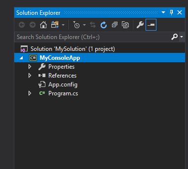
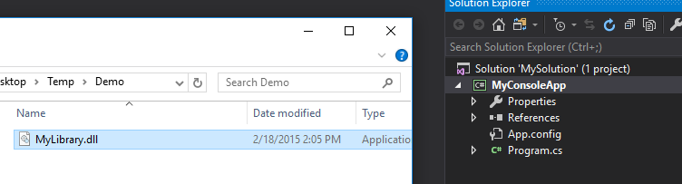
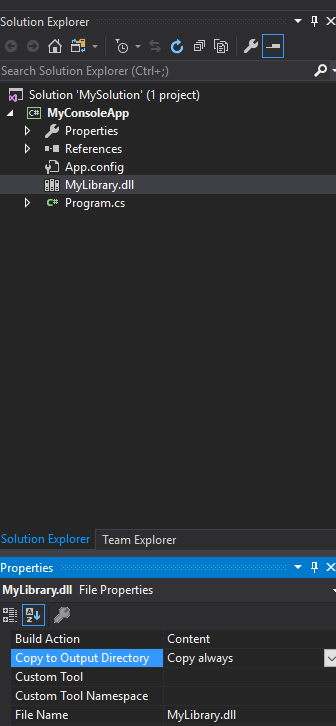
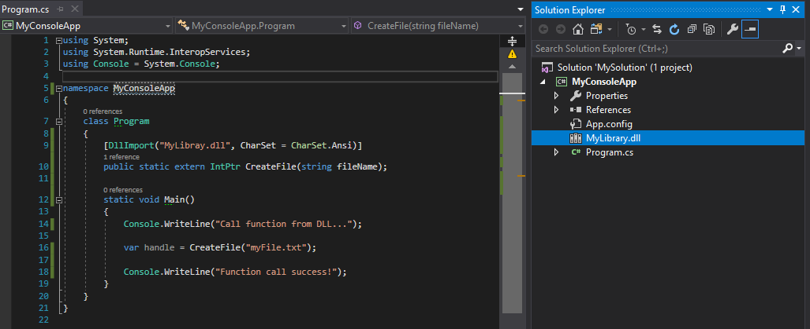

[Blog Home Page](../../README.md)

# How to Reference and Use a C/C++ DLL in a C# Project

Table of Contents
1. [ Introduction](#-introduction)
2. [Sample C/C++ Library DLL](#sample-c/c++-library-dll)
3. [Steps](#steps)

##  1.  Introduction

Given a library DLL that is written in C/C++, it is straightforward to reference and use the library from another C/C++ application. It is also possible to reference and use the library from a C# application. Here's a quick guide on how to achieve that.

##  2. Sample C/C++ Library DLL
Assume that the library is called `MyLibrary.dll` and the function to import is `CreateFile` which accepts a  filename of type `char*`.

##  3. Steps
1. Create a C# Project.  

2. Drag and drop the C/C++ DLL into the C# project.  

3. Set the C/C++ DLL's properties to Content and Copy Always.  

4. Import the `CreateFile` function from the C/C++ DLL with the `DllImport` statement and call the imported function in the C# application.  
