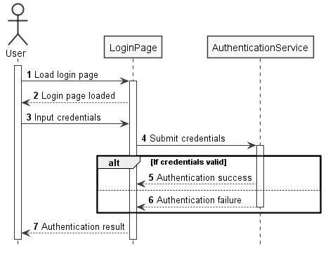

[Blog Home Page](../../README.md)

# Scriptable UML Diagrams With PlantUML

_Tags: Documentation, UML_

Table of Contents
1. [Introduction](#introduction)
2. [Why Create UML Diagrams From Script](#why)
3. [Example: Scripting a Sequence Diagram](#script)
4. [Generating a Diagram](#generate)
5. [Conclusion](#conclusion)
6. [Comments](#comments)

##  1. <a name='introduction'></a>Introduction

With [PlantUML](https://plantuml.com/), you can create UML diagrams from a script/text file. This is opposed to placing and connecting objects in a graphical editor.

## 2. <a name='why'></a>Why Create UML Diagrams From Script

### Pros

* No need to play around with graphical properties like object size, object alignment, etc
* Consistent appearance of objects like size, colour, etc
* The script more closely follows/describes the code
* The script works better with source control tools, and supports text-based diffs
* Often saves time, especially for complex diagrams. For example, modifying a section in the middle of the diagram will automatically move surrounding objects to make room

### Cons

* More learning curve than some graphical tools
* Non-developers may have a preference for the graphical approach
* Less fine-tuning and control over generated diagram

### Summary

The script-based approach to creating UML diagrams may not be the right choice for everyone but it could be the right choice people who are more technically-inclined. These people will find that it is a pleasant experience and huge time saver.

## 3. <a name='script'></a>Example: Scripting a Sequence Diagram

The following example will go through scripting a sequence diagram for a theoretical user login flow. The user navigates to a login page, enters their credentials, which gets sent to an authentication service for validation, and the validation result is returned.



`UserLoginSequence.puml` with comments on lines of interest:
```
' Start the diagram named UserLoginSequence
@startuml UserLoginSequence

' Automatically prefix each step with a number
autonumber

' Don't show actors and particpants at the footer
hide footbox

' Use monochrome colour scheme 
skinparam monochrome true

' Disable box shadows 
skinparam Shadowing false

' Define actors and participants
actor User
participant LoginPage
participant AuthenticationService

' Start User activation box on User lifeline
activate User

' Message from User to LoginPage and LoginPage activation
User -> LoginPage ++: Load login page

' Reply from LoginPage to User
LoginPage --> User: Login page loaded

User -> LoginPage: Input credentials

LoginPage -> AuthenticationService ++: Submit credentials

' Alternative symbol
alt If credentials valid
  ' True reply
  AuthenticationService --> LoginPage: Authentication success
else
  ' False reply and AuthenticationService deactivation
  AuthenticationService --> LoginPage --: Authentication failure
end

LoginPage --> User: Authentication result

' End the diagram
@enduml
```

## 4. <a name='generate'></a>Generating a Diagram

Here are some options to generate a UML diagram with PlantUML.

### PlantUML Local and Web

[This installation guide](https://plantuml.com/starting) presents instructions to install PlantUML locally or by using an [online server](http://www.plantuml.com/plantuml/uml).

### Visual Studio Code Integration

It is possible to install a Visual Studio Code PlantUML extension. This is convinient for scripting, previewing and generating UML diagrams all from the same tool. A future post will go into detail on how to set this up.

## 5. <a name='conclusion'></a>Conclusion

In addition to creating UML diagrams in a graphical editor, having the option to script UML diagrams is beneficial to many. There are pros and cons to both approaches and people who are technically-inclined may prefer the script-based approach.

## 6. <a name='comments'></a>Comments
_Reply to [this tweet](https://twitter.com/innochi_mob/status/1259327160835244035)._