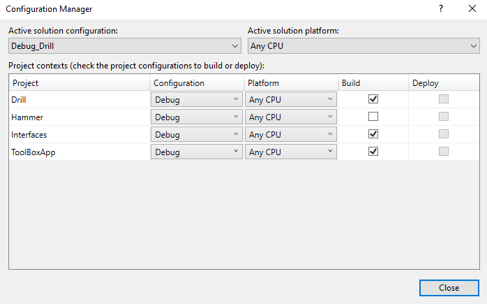

[Blog Home Page](../../README.md)

# Dynamic Module Loading With Ninject

_Tags: .NET, C#, Dependency Injection, Dynamic, Modules, Ninject_

Table of Contents
1. [Introduction](#introduction)
2. [Use Cases](#use)
3. [Ninject](#ninject)
4. [Example](#example)
5. [Conclusion](#conclusion)
6. [Comments](#comments)

##  1. <a name='introduction'></a>Introduction

Dynamic module loading is the act of locating and loading modules at run-time. Instead of defining what modules and implementations to load via code, define the interfaces of the modules and then bind the desired implementations dynamically at run-time.

## 2. <a name='use'></a>Use Cases

Here is a quote from [Ninject's documentation](https://github.com/ninject/Ninject/wiki/Modules-and-the-Kernel#dynamic-module-loading):
> This module location strategy is often used for plugin or Composite based architecture styles such as the Onion Architecture and allows one to decouple your container application from its slot-in subsystems.

## 3. <a name='ninject'></a>Ninject

[Ninject](https://github.com/ninject/Ninject) is a dependency injection tool that includes a feature which enables dynamic module loading - the focus of this article.

## 4. <a name='example'></a>Example

### Introduction

This is a simple example of how to achieve dynamic module loading with Ninject. There are many ways to do dynamic module loading - this is one of them. In this example, the main console application is a simulated tool box. A tool is dynamically loaded at run time and the sound that it makes is written to the console output. Also included in this example is a basic setup for slotting in a different tools for dynamic module loading.

### Solution Structure

There are four projects:
1. Drill - the drill module, to be loaded dynamically. The Drill makes a "Whir" sound.
2. Hammer - the hammer module, to be loaded dynamically. The Hammer makes a "Wham" sound.
3. Interfaces - interface definitions common to all projects.
4. ToolBoxApp - console application that will perform the dynamic module loading and output the sound of the dynamically loaded tool. Only one tool can be loaded at a time.


### Interfaces

This project contains the `ITool` interface as defined below. This common interface will be referenced by the other projects.

`ITool.cs`:
```c#
namespace Interfaces
{
    public interface ITool
    {
        string Use();
    }
}
```

### ToolBoxApp

This project has a dependency on the Ninject 3.3.4 Nuget package. The main method:
1. Creates a Ninject kernel.
2. Performs dynamic module loading by locating and loading all Ninject modules in the Modules directory.
3. Gets the dynamically loaded implementation of `ITool`.
4. Writes the sound that the dynamically loaded tool makes to console output.

`Program.cs`:
```c#
using Interfaces;
using Ninject;
using System;

namespace ToolBoxApp
{
    class Program
    {
        static void Main(string[] args)
        {
            var kernel = new StandardKernel();
            kernel.Load("Modules\\*.dll");

            var tool = kernel.Get<ITool>();
            Console.WriteLine(tool.Use());
            
            Console.ReadLine();
        }
    }
}
```

### Drill

This project implements the `Drill` tool and `DrillModule` Ninject module. Ninject will load the `DrillModule` if it is found.

`Drill.cs`:
```c#
using Interfaces;

namespace Drill
{
    public class Drill : ITool
    {
        public string Use()
        {
            return "Whir";
        }
    }
}
```

`DrillModule.cs`:
```c#
using Interfaces;
using Ninject.Modules;

namespace Drill
{
    public class DrillModule : NinjectModule
    {
        public override void Load()
        {
            Bind<ITool>().To<Drill>();
        }
    }
}

```

### Hammer

This project implements the `Hammer` tool and `HammerModule` Ninject module. Ninject will load the `HammerModule` if it is found.

`Hammer.cs`:
```c#
using Interfaces;

namespace Hammer
{
    public class Hammer : ITool
    {
        public string Use()
        {
            return "Wham";
        }
    }
}
```

`HammerModule.cs`:
```c#
using Interfaces;
using Ninject.Modules;

namespace Hammer
{
    public class HammerModule : NinjectModule
    {
        public override void Load()
        {
            Bind<ITool>().To<Hammer>();
        }
    }
}

```

### Solution Configurations

Solution configurations will be used to enforce which module will be dynamically loaded by `ToolBoxApp`. If the solution is built with the `*_Drill` configuration, then the `DrillModule` will be loaded. If the solution is built with the `*_Hammer` configuration, then the `HammerModule` will be loaded.

`Debug_Drill` configuration (note that the `Hammer` project is not built):



`Debug_Hammer` configuration (note that the `Drill` project is not built):


### Build Events

`ToolBoxApp` pre-build event (this will delete any existing Modules folder and create an empty Modules folder):
```
rd "$(TargetDir)Modules" /s /q
mkdir "$(TargetDir)Modules"
```

`Drill` post-build event (this will copy Drill.dll to `ToolBoxApp`'s Modules folder):
```
xcopy "$(TargetDir)$(TargetFileName)" "$(SolutionDir)ToolBoxApp\$(OutDir)Modules" /i /y
```

`Hammer` post-build event (this will copy Hammer.dll to `ToolBoxApp`'s Modules folder):
```
xcopy "$(TargetDir)$(TargetFileName)" "$(SolutionDir)ToolBoxApp\$(OutDir)Modules" /i /y
```

### Running the Application with the Drill Module

1. Select the Solution configuration `Debug_Drill` or `Release_Drill`.
2. Rebuild the solution.
3. Verify that Drill.dll exists in `ToolBoxApp`'s Modules folder.
4. Verify that Hammer.dll does not exist in `ToolBoxApp`'s Modules folder.
5. Run `ToolBoxApp`.
   * You should see **Whir** in the console output window.

### Running the Application with the Hammer Module

1. Select the Solution configuration `Debug_Hammer` or `Release_Hammer`.
2. Rebuild the solution.
3. Verify that Hammer.dll exists in `ToolBoxApp`'s Modules folder.
4. Verify that Drill.dll does not exist in `ToolBoxApp`'s Modules folder.
5. Run `ToolBoxApp`.
   * You should see **Wham** in the console output window.

## 5. <a name='conclusion'></a>Conclusion

In addition to Ninject being a great dependency injection tool, Ninject also makes dynamic module loading possible. In the example, `ToolBoxApp` dynamically loads all Ninject modules that are present in the Modules folder. The combination of Solution configurations and build events ensure that only one of `DrillModule` (Drill.dll) or `HammerModule` (Hammer.dll) will exist in the Modules folder at a given time.

The full example source code can be found [here](src).

## 6. <a name='comments'></a>Comments

_Reply to [this tweet]()._