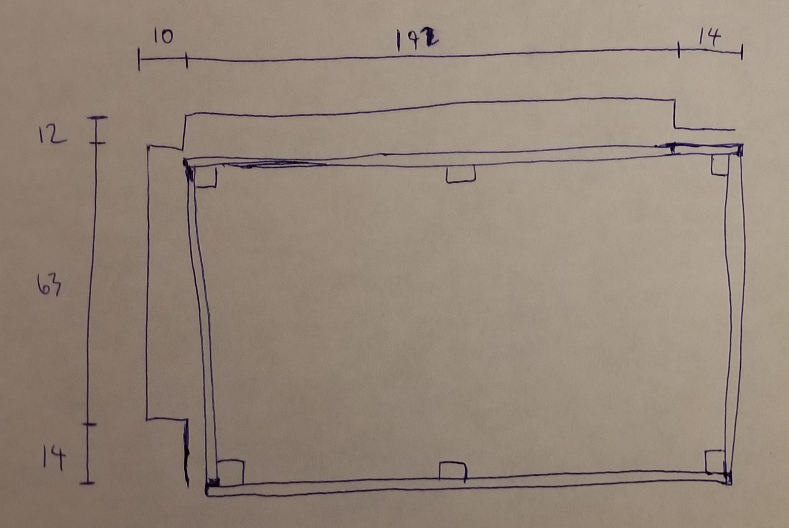
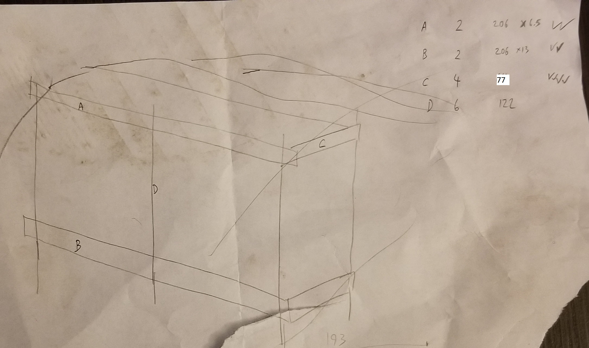
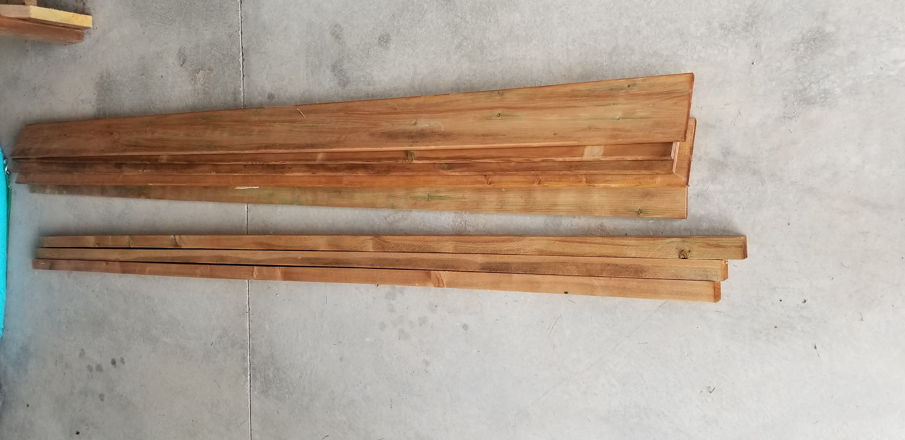
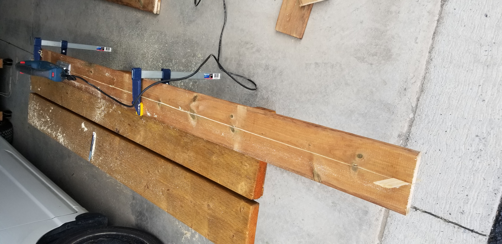
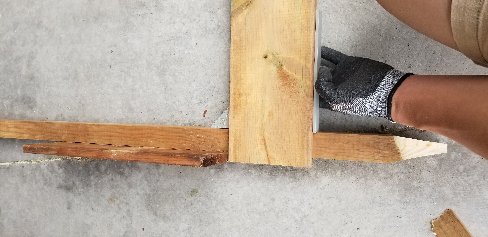
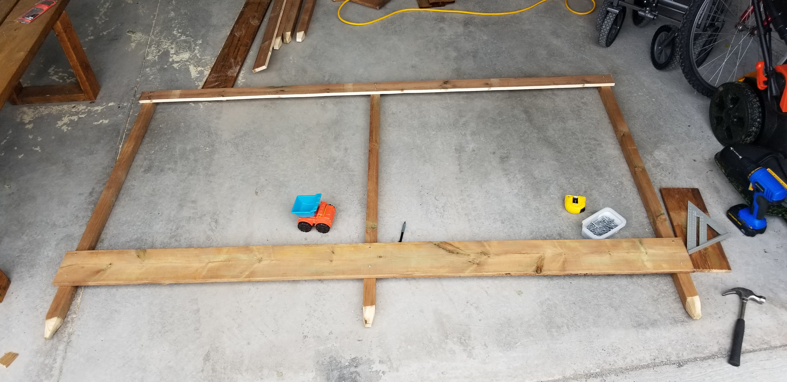
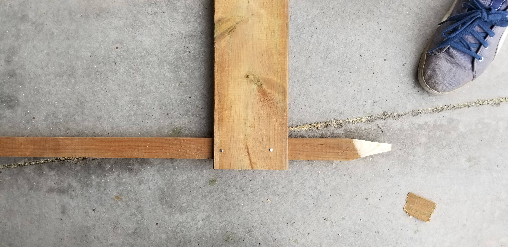
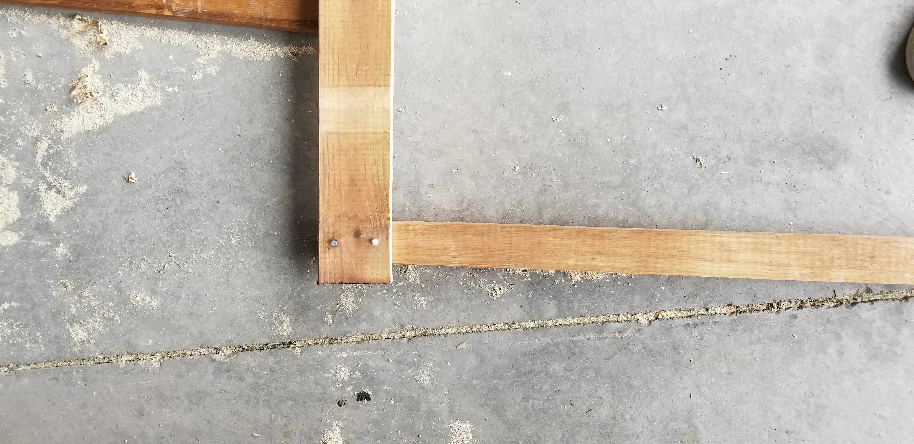
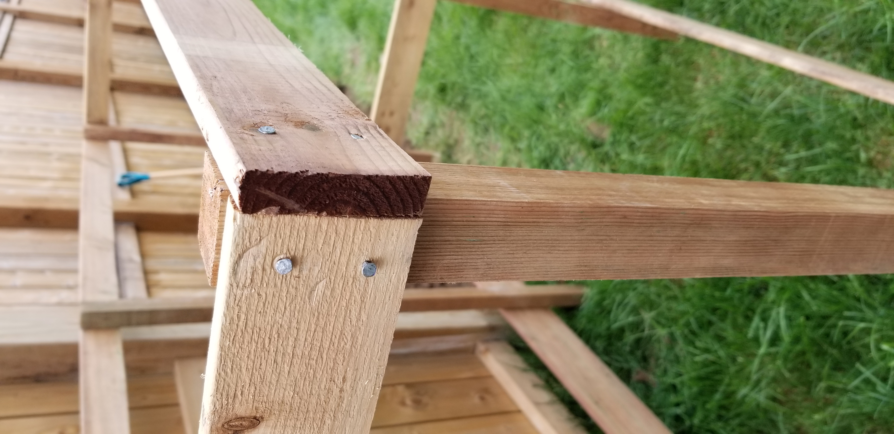
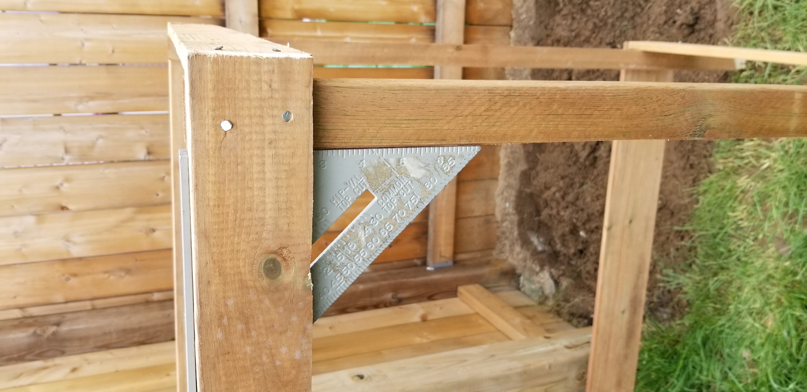

[Blog Home Page](../../README.md)

# Garden Fence With Limited Tools

_Tags: DIY, Gardening, Home_

Table of Contents
1. [Introduction](#introduction)
2. [Dimensions](#dimensions)
3. [Materials and Tools](#materials)
4. [Building the Frame](#frame)
5. [Digging](#digging)
6. [Installing Chicken Wire](#wire)
7. [Conclusion](#conclusion)
8. [Comments](#comments)

##  1. Introduction

This is how I built a barrier to keep animals out of my new garden. My goal was to create something cost effective, sturdy, accessible via a front "door", and simple to make with minimal tools.

## 2. Dimensions

Since construction is so simple, I drew up the plans by hand.

### Top View

The left and top walls are fence posts and fence boards. Dimensions are in cm.

### ISO View

Below is the ISO view along with the cut list. Horizontal boards are 1.9cm (3/4") thick. Posts are 3.8x3.8cm (1.5x1.5"). The upper horizontal boards are half the width of the lower horizontal boards. This keeps the upper weight down and saves costs (since the structure is strong enough even with narrower upper boards). The lower boards need to be wide since half of the width will be buried underground to act as the garden bed's edging. Dimensions are in cm.

## 3. Materials and Tools

### Materials

| Item                         | Quantity   | Cost (CAD)  |
| ---------------------------- | ---------- | ----------- |
| 2x2x8 pressure treated wood  | 3          | 4.55        |
| 1x6x8 pressure treated wood  | 4          | 4.89        |
| 3/4" stainless steel screws  | Dozens     | Already had |
| 2" galvanized nails          | Dozens     | Already had |
| Roll of plastic chicken wire | 1          | 20          |

### Tools

* **Hammer** to drive nails for frame.
* **Drill** to drill pilot holes and to drive screws for chicken wire.
* **Jigsaw** to cross cut wood to length and rip cut wood to width.
* **Square and measuring tape** for marking and measuring.
* **Spade shovel** for edging and digging.
* **Hand shovel** for digging deep post holes.

## 4. Building the Frame

## 5. Digging

## 6. Installing Chicken Wire

## 7. Conclusion

## 8. Comments

_Reply to [this tweet]()._