[Blog Home Page](../../README.md)

# Garden Fence With Limited Tools

_Tags: DIY, Gardening, Home_

Table of Contents
1. [Introduction](#introduction)
2. [Dimensions](#dimensions)
3. [Materials and Tools](#materials)
4. [Building the Frame](#frame)
5. [Installation](#installation)
6. [Installing Chicken Wire](#wire)
7. [Conclusion](#conclusion)
8. [Comments](#comments)

##  1. Introduction

This is how I built a barrier to keep animals out of my new garden. My goal was to create something cost effective, sturdy, accessible via a front "door", and simple to make with minimal tools.

## 2. Dimensions

Since construction is so simple, I drew up the plans by hand.

### Top View

The left and top walls are fence posts and fence boards. Dimensions are in cm.

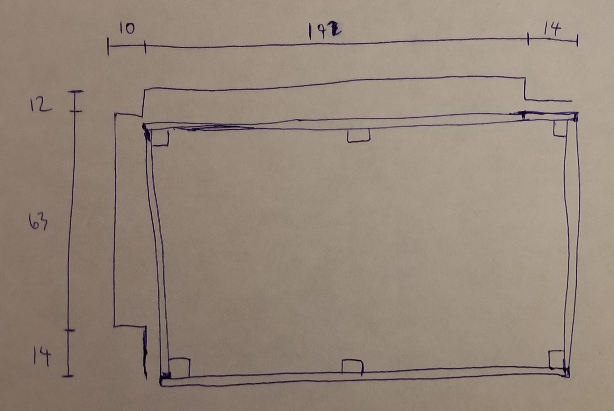

### ISO View

Below is the ISO view along with the cut list. Horizontal boards are 1.9cm (3/4") thick. Posts are 3.8x3.8cm (1.5x1.5"). The upper horizontal boards are half the width of the lower horizontal boards. This keeps the upper weight down and saves costs (since the structure is strong enough even with narrower upper boards). The lower boards need to be wide since half of the width will be buried underground to act as the garden bed's edging. The posts will be 25cm under ground. Dimensions are in cm.

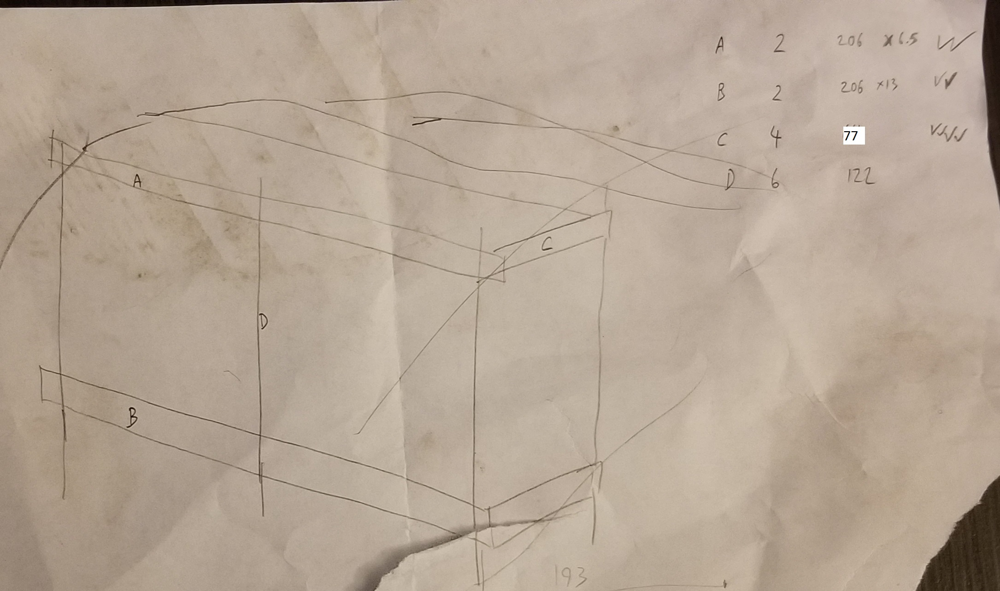

## 3. Materials and Tools

### Materials

| Item                         | Quantity   | Cost (CAD)  |
| ---------------------------- | ---------- | ----------- |
| 2x2x8 pressure treated wood  | 3          | 4.55        |
| 1x6x8 pressure treated wood  | 4          | 4.89        |
| 3/4" stainless steel screws  | Dozens     | Already had |
| 2" galvanized nails          | Dozens     | Already had |
| Roll of plastic chicken wire | 1          | 20          |

### Tools

* **Hammer** to drive nails for frame.
* **Drill** to drill pilot holes and to drive screws for chicken wire.
* **Jigsaw** to cross cut wood to length and rip cut wood to width.
* **Square and measuring tape** for marking and measuring.
* **Spade shovel** for edging and digging.
* **Hand shovel** for digging deep post holes.
* **Scissors** for cutting chicken wire.

## 4. Building the Frame

1. Cross cut lumber to length.
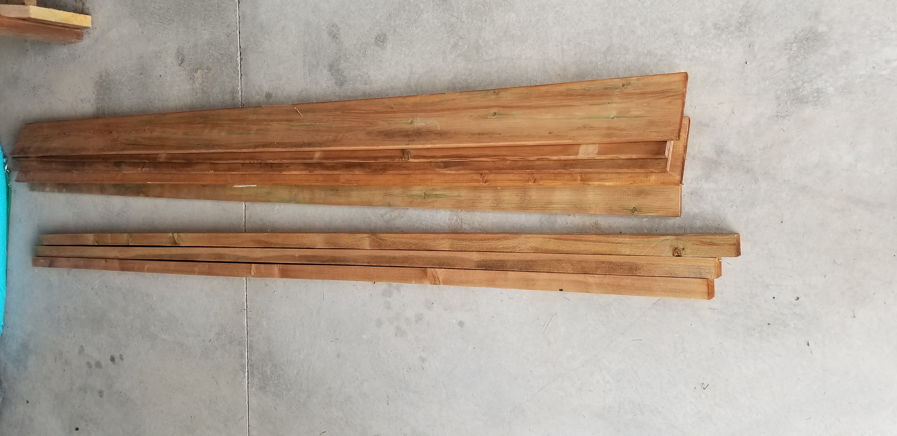

2. Rip cut lumber in half for upper horizontal boards. A shim is placed at the cut end of the board to reduce pinching.
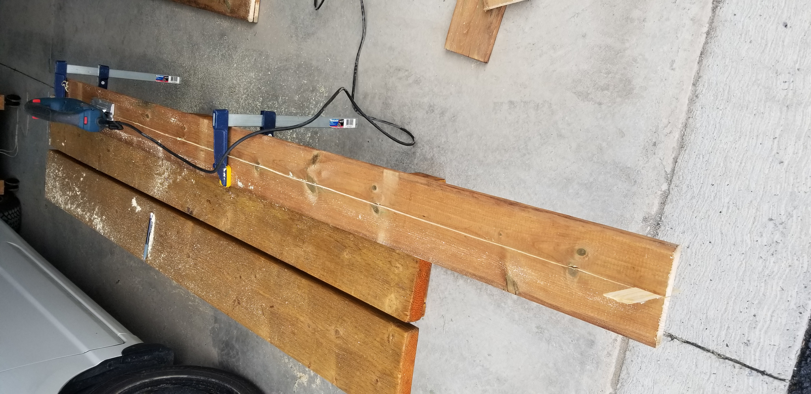

3. Form the bottom of the posts into a spike for easier installation later.

4. Place the lower horizontal board onto the post. The distance from the  middle of the board to the bottom of the post should be 25cm since the post will be under ground 25cm. The horizontal board should extend past the post to cover the end grain of the orthoganal board. A square is used to ensure squareness.
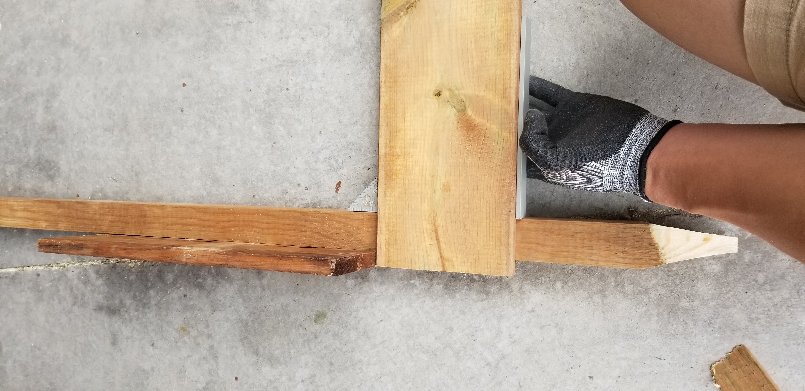

5. Layout horizontal boards and posts.
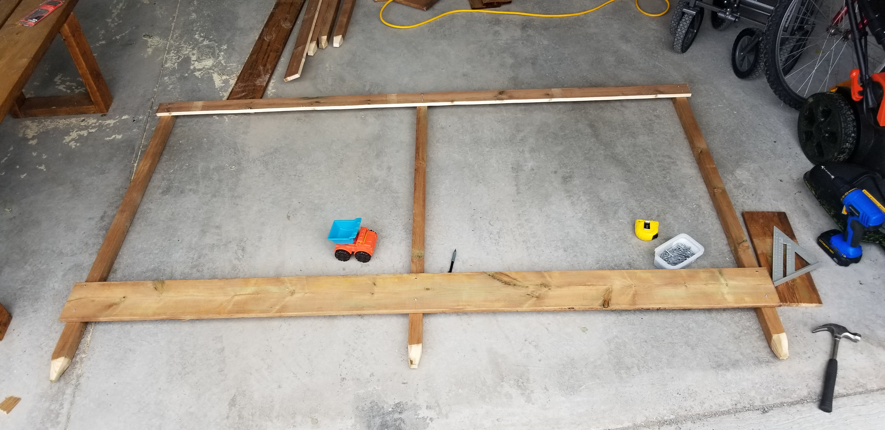

6. Nail lower horizontal boards to posts.
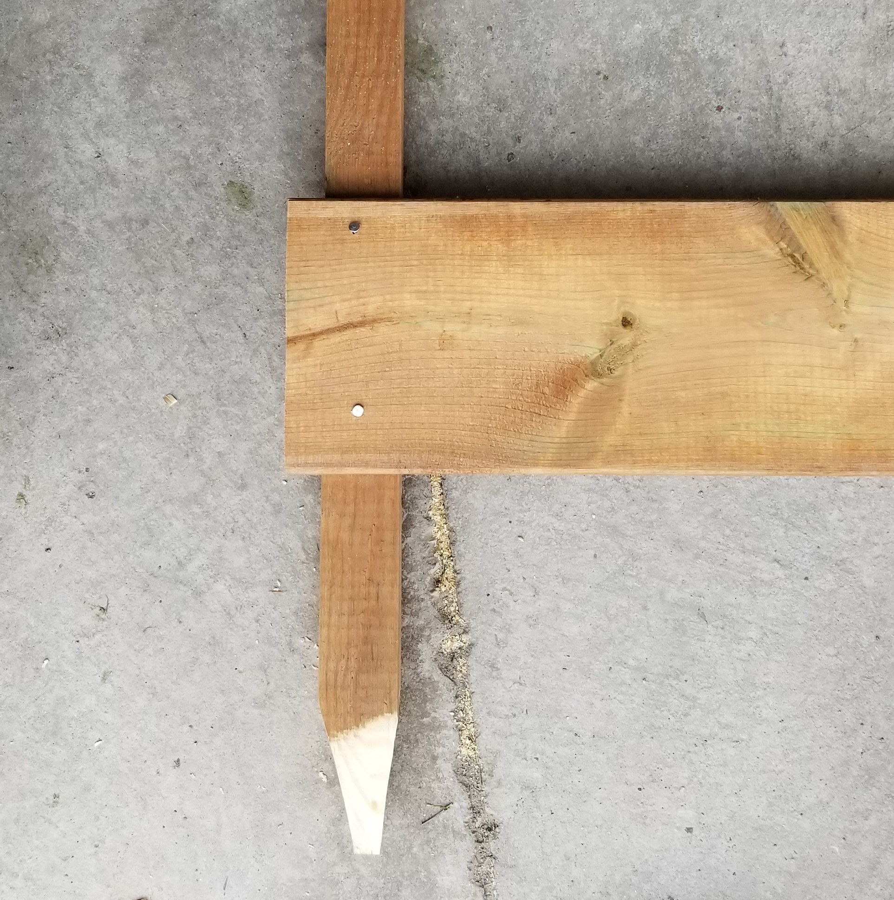

7. Nail upper horizontal boards to posts.
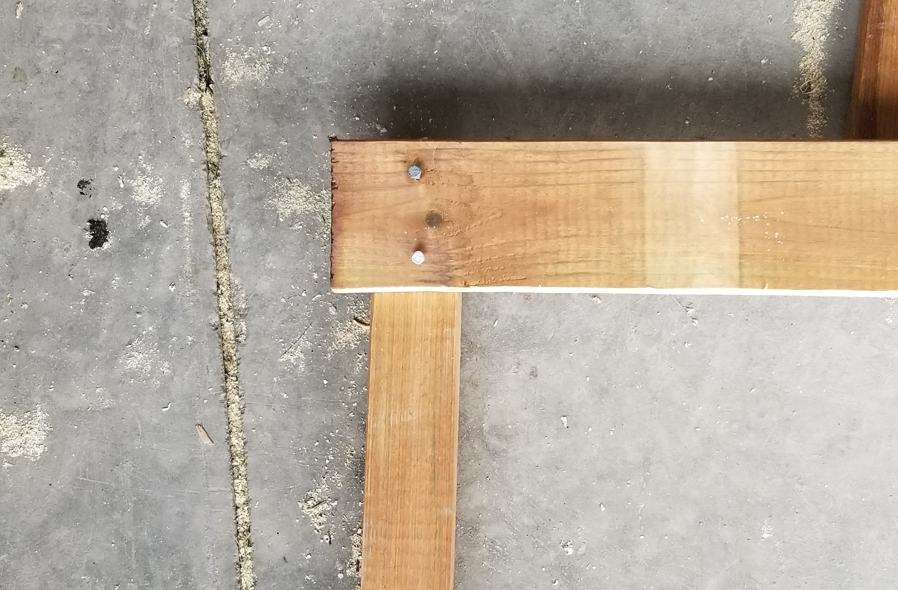

8. Repeat steps 2-7 for the back of the frame.

9. Attach back and front of frame with horizontal boards.

10. This is what the corner looks like. The front horizontal board extends past the post to cover the orthoganal board's end grain.
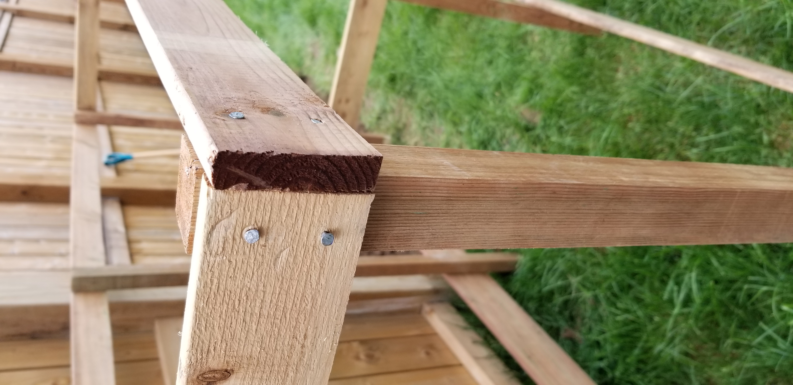

11. Check to ensure that the frame is "square enough" once in a while.
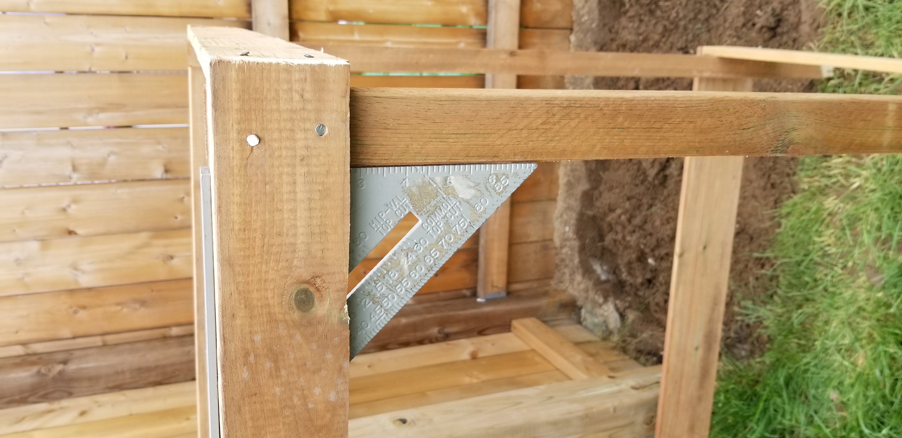

12. This is the completed frame.
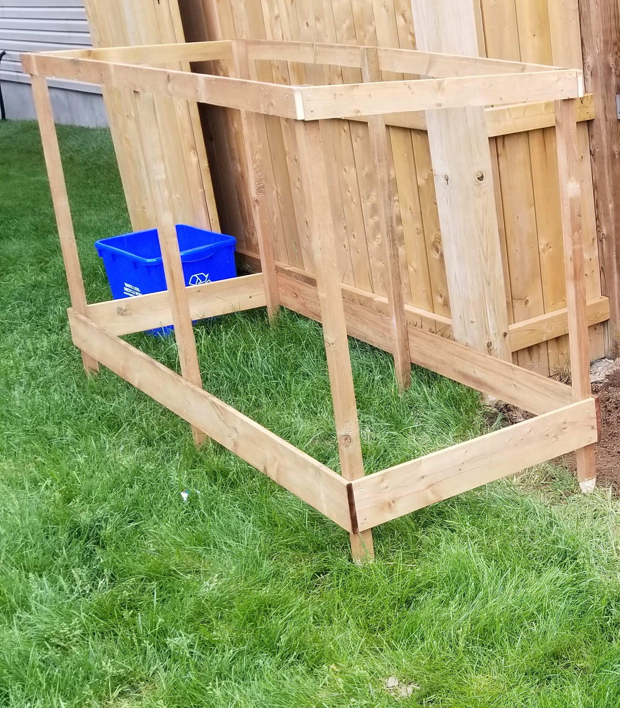

## 5. Installation

1. Use a spade shovel to form a rectangular edge for the garden bed.

2. Dig deep enough around the edge so that half of the lower horizontal board will be underground.

3. Dig the post holes with a hand shovel deep enough so that the posts will be 25cm underground.

4. Place the frame inside the garden bed.

## 6. Installing Chicken Wire

1. Screw the 3/4" screws at regularly spaced intervals on the frame.

2. Measure and cut the chicken wire.

3. Place the chicken wire on the frame and stretch the chicken wire so that it is tight and under tension and then place it onto the screws to keep it in place.

4. Cut 2 boards for the front access door.

5. Secure the chicken wire to a board. I used screws and washers.
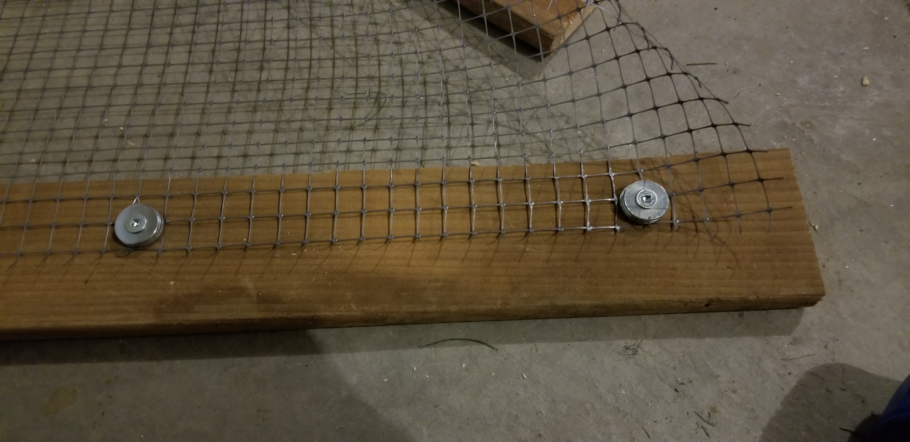

6. Install the front access door chicken wire to the top of the frame.

7. Screw a small block to the lower horizontal board to keep the front access door board in place.
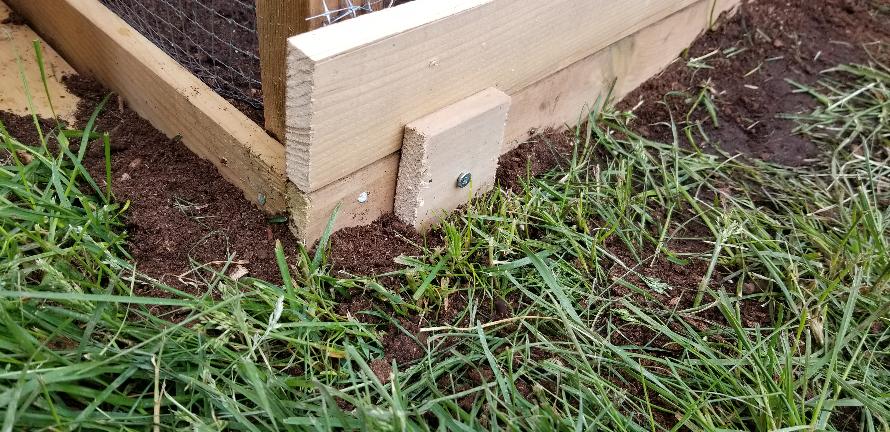

Lift the board to open the front access door.

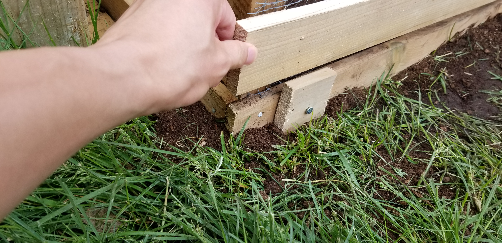

8. Repeat steps 5-7 for the other door.

## 7. Conclusion

The final product.

With one access door open.

I also cut left over boards to cover the surrounding area to reduce unwanted vegetation growth.
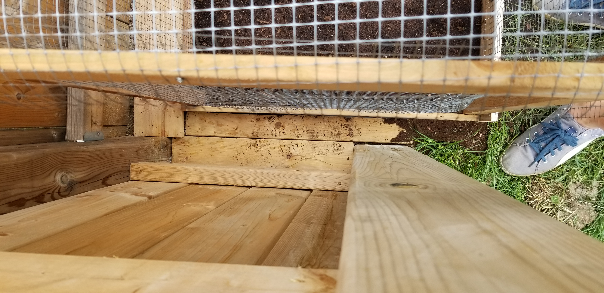

## 8. Comments

_Reply to [this tweet]()._