[Blog Home Page](../../README.md)

# Connect to SQL Server Database with an IP Address

_Tags: Administration, Virtualization, VM, VMware_

Table of Contents
1. [Introduction](#introduction)
2. [Set Up SQL Server to Connect by IP Address](#server)
3. [Set Up a Sample Database](#database)
4. [Test the Connection](#test)
5. [Comments](#comments)

## 1. Introduction

By default, SQL Server is set up to allow remote connections by server name. Additional steps are required to allow remote connections by IP address.

The following software is used in this article:
* Windows Server 2016
* SQL Server Express 2019
* SQL Server Management Studio

## 2. Set Up SQL Server to Connect by IP Address

1. Open SQL Server Management Studio and log in.

2. Right click on the SQL Server instance in Object Explorer.

3. Select Properties > Connections.

4. Check "Allow remote connections to the server".

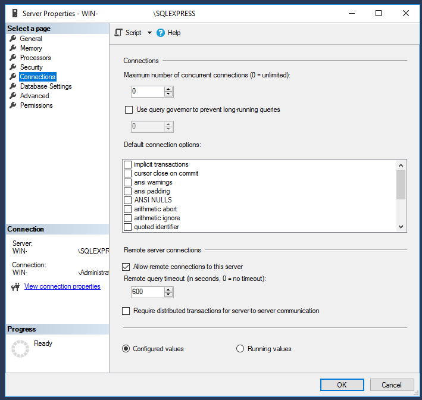

5. Open SQL Server Configuration Manager.

6. In the left pane, select SQL Server Network Configuration > Protocols for SQLEXPRESS.

7. In the right pane, enable TCP/IP.

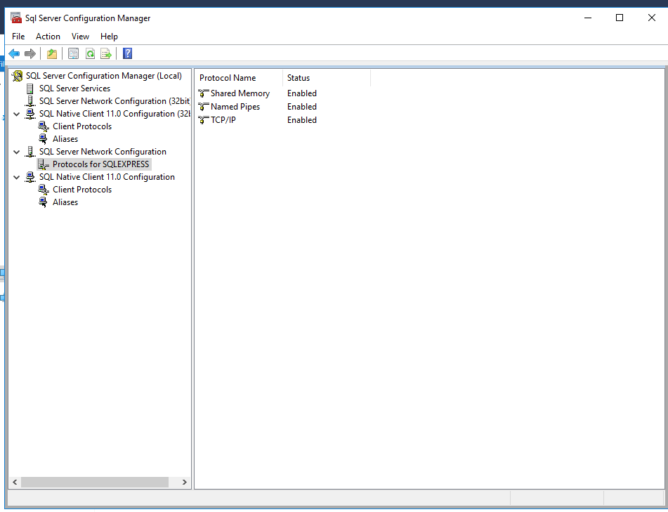

8. In the right pane, right click TCP/IP > IP Addresses.

9. Under IPAll, clear out TCP Dynamic Ports and set TCP Port to 1433.

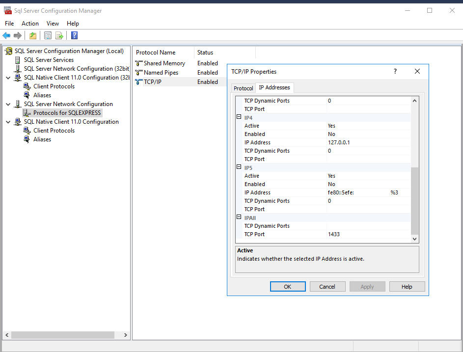

10. In the left pane, select SQL Server Services.

11. In the right pane, select SQL Server (SQLEXPRESS) > right click > Restart.

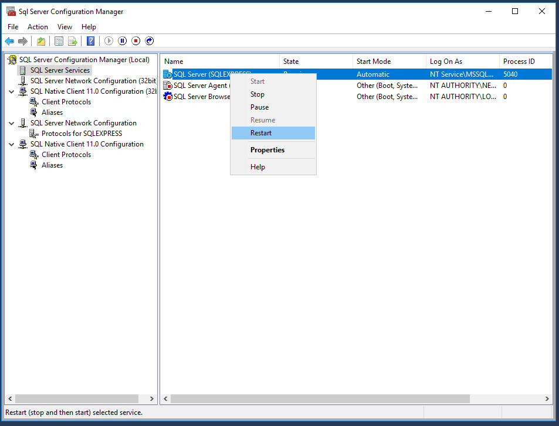

12. Open Windows Firewall with Advanced Security.

13. Follow the wizard to create a new Inbound rule to allow TCP port 1433.

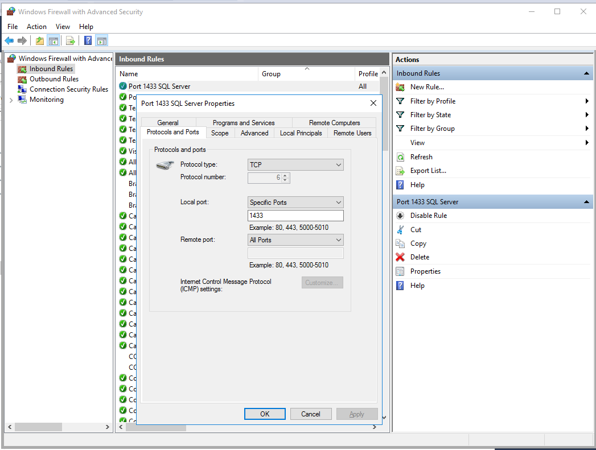

## 3. Set Up a Sample Database

1. Create database.

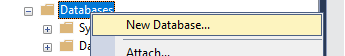

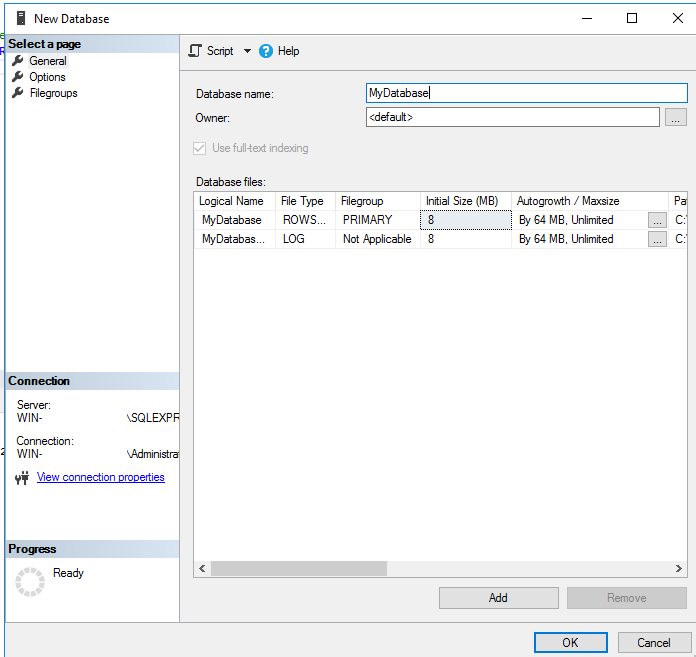

2. Create login and user.

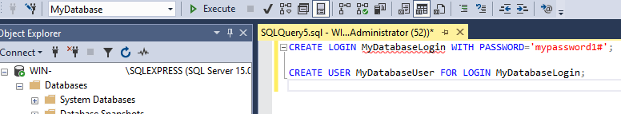

3. Assign user memberships.

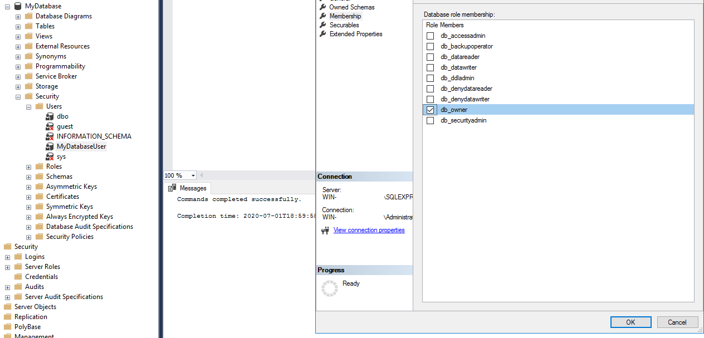

## 4. Test the Connection

1. On another machine, create a test.udl file.

2. Double click the test.udl file to open it.

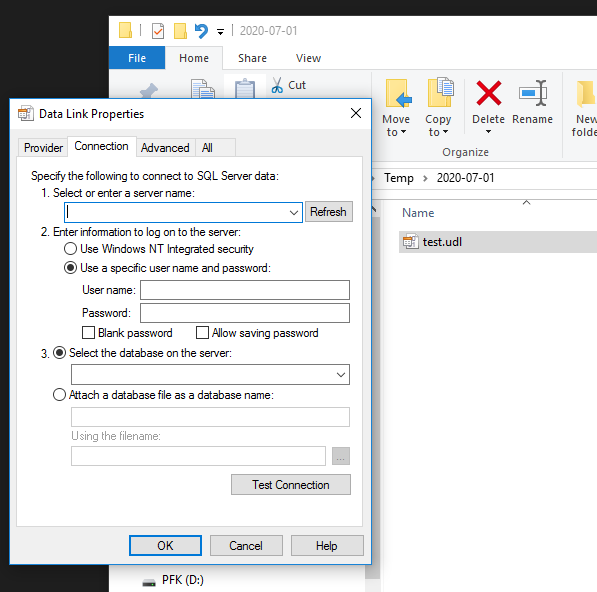

3. Input information. Note the use of ",1433" to specify the port number.

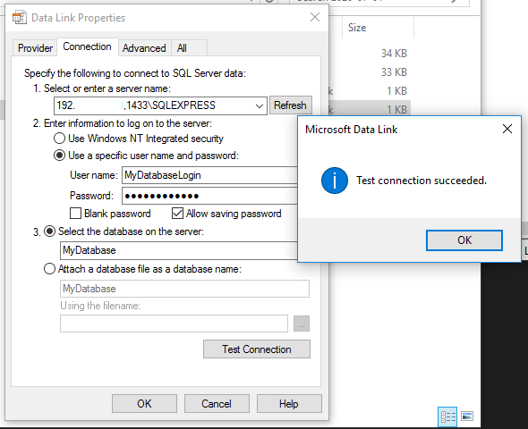

4. Click Test Connection. The result should be "Test connection succeeded".

5. Open test.udl with notepad to get the connection string.

## 5. Comments

_Reply to [this tweet](https://twitter.com/innochi_mob/status/1278857302750253057)._