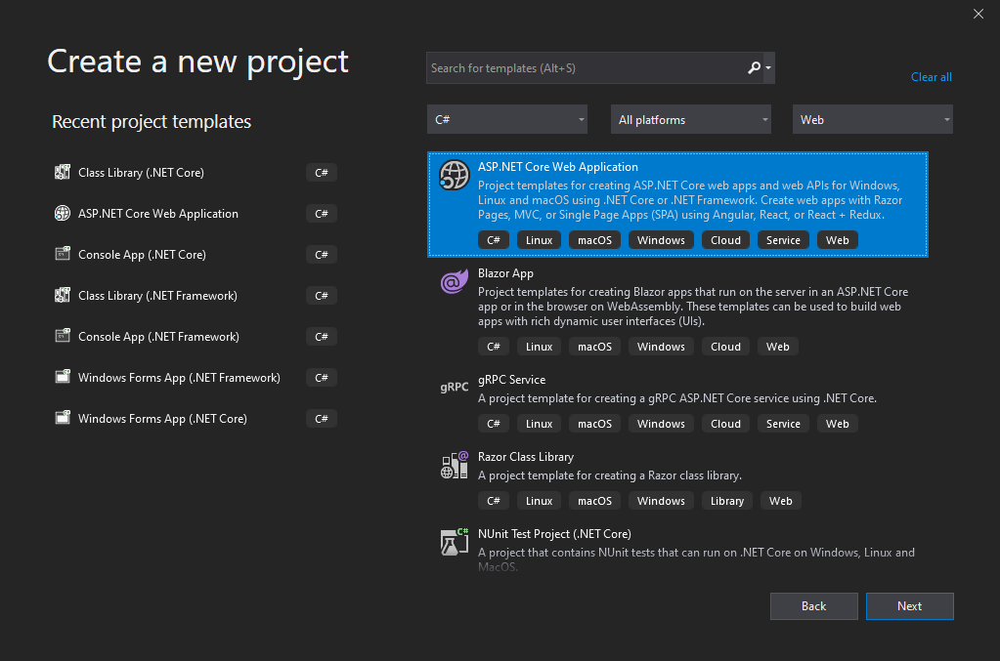
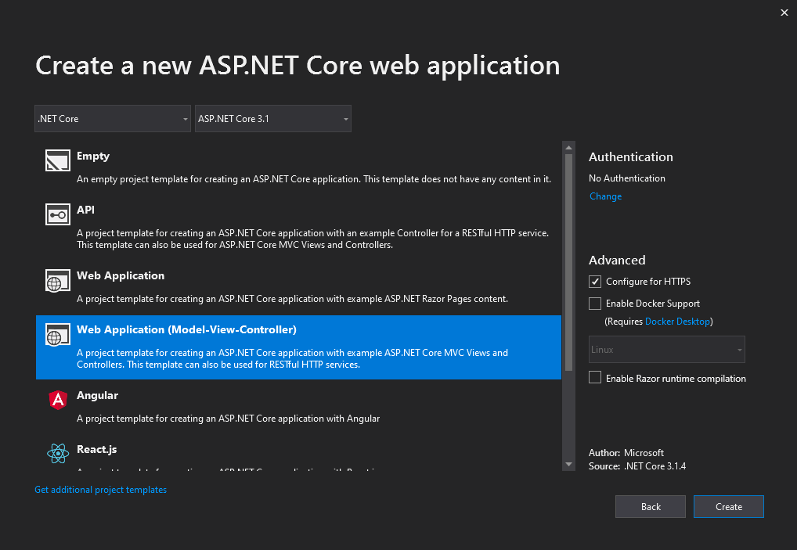
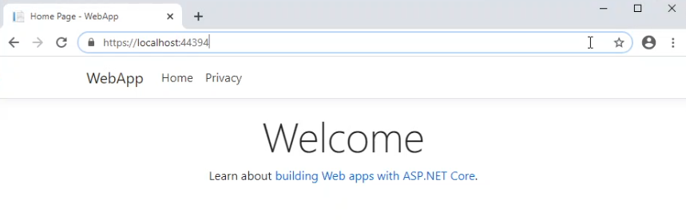
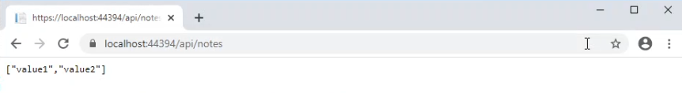
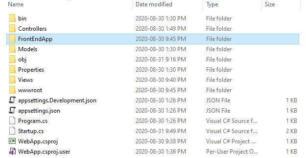
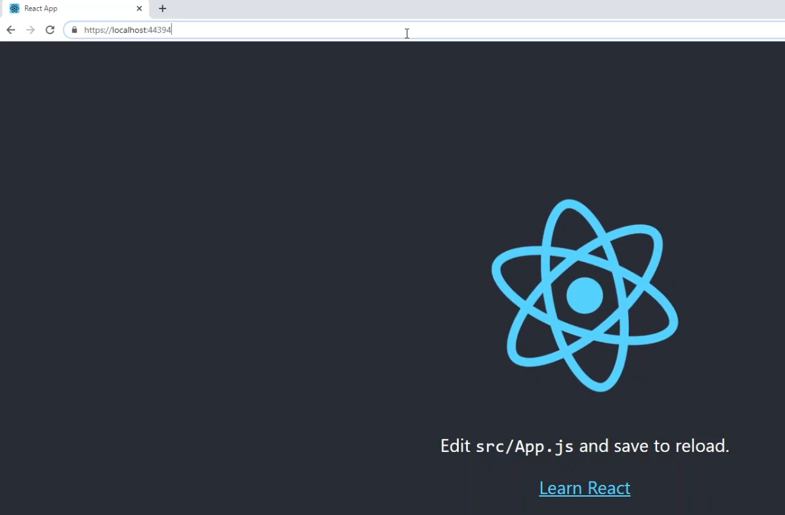
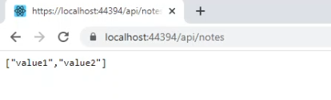

[Blog Home Page](../../README.md)

# Create a Web App with ReactJS and .NET Core (Part 1)

_Tags: .NET, Back End, C#, Front End, Full Stack, Javascript, React_

Table of Contents
1. [Introduction](#introduction)
2. [Create a .NET Core Back End](#create-back)
3. [Create a ReactJS Front End](#create-front)
4. [Host the Front End and Back End on the Same Domain](#host)
5. [Work Flow: Editing the Back End](#edit-back)
6. [Work Flow: Editing the Front End](#edit-front)
7. [Conclusion](#conclusion)
8. [Comments](#comments)

## 1. <a name='introduction'></a>Introduction

This will be the first of a multi-part series on how to create a web app with a ReactJS front end and a .NET Core backend. Part one will be about setting up the ReactJS and .NET Core projects and hosting them on the same domain. Part two will be about adding CRUD functionality to the front and back end. Part three will be about security/authentication. The final part will be about deploying the application to Azure.

## 2. <a name='create-back'></a>Create a .NET Core Back End

The back end will be a .NET Core REST API. For this article, I am using Visual Studio 2019 and .NET Core 3.1.

1. Create a new "ASP.NET Core Web Application".

2. Select "Web Application (Model-View-Controller)".

3. After the project is created, add a new controller with the selection "API Controller with read/write actions". Name the controller "NotesController".
4. Remove the following lines in Startup.cs:
```c#
app.UseEndpoints(endpoints =>
{
    endpoints.MapControllerRoute(
        name: "default",
        pattern: "{controller=Home}/{action=Index}/{id?}");
});
```
And replace it with:
```c#
app.UseMvc(routes =>
{
    routes.MapRoute(
        name: "default",
        template: "{controller=Home}/{action=Index}/{id?}");

    routes.MapRoute(
        name: "api",
        template: "api/{controller=Default}/{action=Index}/{id?}");
});
```
5. Add the following in Startup.cs `ConfigureServices` method: 
```c#
services.AddMvc(a => { a.EnableEndpointRouting = false; });
```
6. Run the project (start debugging) and you should see the front end render:

6. Navigate to /api/notes and you should see the response to an API `GET /api/notes` request:


## 3. <a name='create-front'></a>Create a ReactJS Front End

The front end will be a ReactJS app bootstrapped from the popular `create-react-app` package. For this article, I am using Windows so commands may need to be modified if you are using a different operating system.

1. Create a new folder in the project named "FrontEndApp".

2. Open a command window in the "FrontEndApp" folder and execute the following to create a new react app.
```
npx create-react-app my-app
```

## 4. <a name='host'></a>Host the Front End and Back End on the Same Domain

1. Edit the "build" value in package.json as follows. When the react app is built (eg. for production), this script will move the output directory to wwwroot so that the front end can be hosted from the same server as the back end.
```
"scripts": {
    ...
    "build": "react-scripts build && (if exist ../wwwroot rmdir \"../wwwroot\" /q /s) && move build ../wwwroot",
    ...
```
2. Copy the contents of the index.html file that was built in the previous step.
3. Paste into "Views/Home/Index.cshtml".
4. Remove the following lines from "Views/_ViewStart.cshtml".
```
{
    Layout = "_Layout";
}
```
5. Run the project (start debugging) and you should see the front end ReactJS app render:

6. Navigate to /api/notes and you should still see the response to an API `GET /api/notes` request. This demonstates that both the ReactJS app and .NET Core back end are being hosted from the same domain.

7. Optional: remove unnecessary files from the project (eg. _Layout.cshtml, etc).

## 5. <a name='edit-back'></a>Work Flow: Editing the Back End

You can edit the back end in the usual way: modify a file, build the solution, then run the project (start debugging).

## 6. <a name='edit-front'></a>Work Flow: Editing the Front End

1. Run the project (start debugging) in Visual Studio to ensure the back end is running.
2. Run the ReactJS app with `npm start`.
3. Edit the front end as desired. This allows you to make use of the conveniences that `create-react-app` has already set up.
4. Stop debugging the project in Visual Studio.
5. Build the front end with `npm run build`.
6. Run the project (start debugging) in Visual Studio and the edited front end will be hosted on the same domain as the back end.

## 7. <a name='conclusion'></a>Conclusion

This was part one of a multi-part series on how to create a web app with a ReactJS front end and a .NET Core backend. This initial part was about setting up the ReactJS and .NET Core projects and hosting them on the same domain. Future parts will continue to build off of this initial part.

The full example source code can be found [here](src).

## 8. <a name='comments'></a>Comments

_Reply to [this tweet](https://twitter.com/innochi_mob/status/1300639608376614912)._