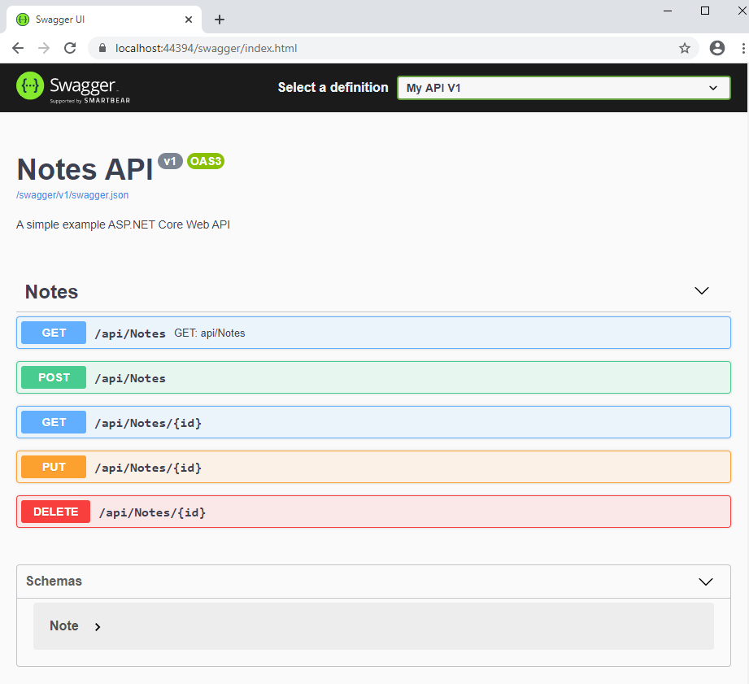

[Blog Home Page](../../README.md)

# Create a CRUD Web App with ReactJS and .NET Core (Part 2)

_Tags: .NET, Back End, C#, Front End, Full Stack, Javascript, React, REST_

Table of Contents
1. [Introduction](#introduction)
2. [Create a Controller with CRUD Actions](#crud-controller)
3. [Create CRUD UI Components](#crud-ui)
4. [Conclusion](#conclusion)
5. [Comments](#comments)

## 1. <a name='introduction'></a>Introduction

## 2. <a name='crud-controller'></a>Create a Controller with CRUD Actions

In this section, we will set up an Entity Framework `DbContext`, create a class for our model, create a controller with CRUD actions using Entity Framework, and add Swagger API docs.

### Packages

1. Install the following Nuget packages.
   * "Microsoft.EntityFrameworkCore" Version="3.1.7"
   * "Microsoft.EntityFrameworkCore.InMemory" Version="3.1.7"
   * "Swashbuckle.AspNetCore" Version="5.5.1"

### Create a DbContext

1. Create a `Notes` class in the Models folder.

```c#
public class Note
{
    public Guid NoteId { get; set; }
    public DateTime CreatedDate { get; set; }
    public string Title { get; set; }
    public string Content { get; set; }
}
```

2. Create a `WebAppContext` class in the Models folder.

```c#
public class WebAppContext : DbContext
{
    public DbSet<Note> Notes { get; set; }

    public WebAppContext(DbContextOptions<WebAppContext> options)
        : base(options)
    {
    }
}
```

## Specify a Database Type

1. Modify `ConfigureServices` in `Startup` as follows

```c#
public void ConfigureServices(IServiceCollection services)
{
    ...

    // Use an Entity Framework in memory database for simplicity
    services.AddDbContext<WebAppContext>(options => options.UseInMemoryDatabase("WebAppContext"));
}
```

### Create a Controller with CRUD Actions

1. Right click on the Controllers folder > Add > Controller > API Controller with actins, using Entity Framework.
2. Select `Note` for Model class.
3. Select `WebAppContext` for Data context class.
4. Click Add.
   * `NotesController` should be created

### Add Seed Data (Optional)

1. Add the following to `WebAppContext`.

```c#
protected override void OnModelCreating(ModelBuilder modelBuilder)
{
    modelBuilder.Entity<Note>().HasData(new[] {
        new Note {
            NoteId = Guid.NewGuid(),
            CreatedDate = DateTime.UtcNow,
            Title = "Note 1",
            Content = "Note 1 content here"
        },
        new Note {
            NoteId = Guid.NewGuid(),
            CreatedDate = DateTime.UtcNow.AddDays(-1),
            Title = "Note 2",
            Content = "Note 2 content here"
        }
    });
}
```

2. Add the following to `NotesController`'s default constructor.

```c#
public NotesController(WebAppContext context)
{
    ...

    // Seed data
    _context.Database.EnsureCreated();
}
```

### Add API Documentation with Swagger

1. Right click on the WebApp project > Properties > Build.

2. Add `;1591` to Suppress warnings.

3. Check the box for XML documentation file.

4. Modify `ConfigureServices` in `Startup` as follows.

```c#
public void ConfigureServices(IServiceCollection services)
{
    ...

    services.AddSwaggerGen(c =>
    {
        c.SwaggerDoc("v1", new OpenApiInfo
        {
            Version = "v1",
            Title = "Notes API",
            Description = "A simple example ASP.NET Core Web API",
        });

        // Set the comments path for the Swagger JSON and UI.
        var xmlFile = $"{Assembly.GetExecutingAssembly().GetName().Name}.xml";
        var xmlPath = Path.Combine(AppContext.BaseDirectory, xmlFile);
        c.IncludeXmlComments(xmlPath);
    });
}
```

5. Modify `Configure` in `Startup` as follows.

```c#
public void Configure(IApplicationBuilder app, IWebHostEnvironment env)
{
    ...

    app.UseSwagger();

    app.UseSwaggerUI(c =>
    {
        c.SwaggerEndpoint("/swagger/v1/swagger.json", "My API V1");
    });
}
```

6. Add XML comments to `NotesController`.

```c#
/// <summary>
/// GET: api/Notes
/// </summary>
/// <remarks>
/// Remarks here
/// </remarks>
/// <returns></returns>
/// <response code="200">Returns list of notes</response>
[HttpGet]
public async Task<ActionResult<IEnumerable<Note>>> GetNotes()
...
```

7. Run the project (start debugging).

8. Navigate to /swagger. The following Swagger API docs should be shown.



## 4. <a name='crud-ui'></a>Create CRUD UI Components

## 5. <a name='conclusion'></a>Conclusion

The full example source code can be found [here](src).

## 6. <a name='comments'></a>Comments

_Reply to [this tweet]()._