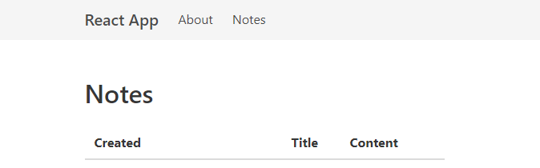
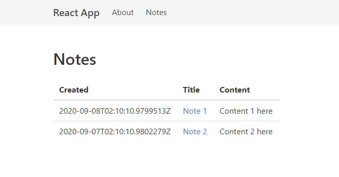
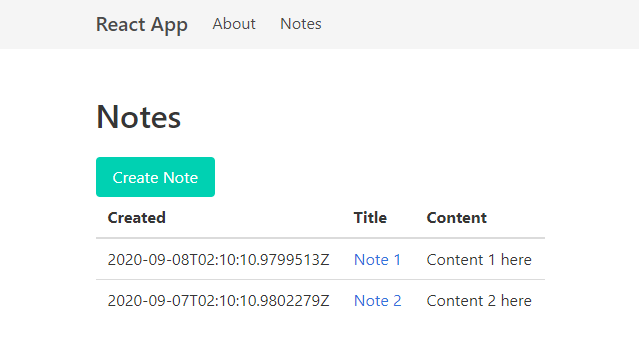
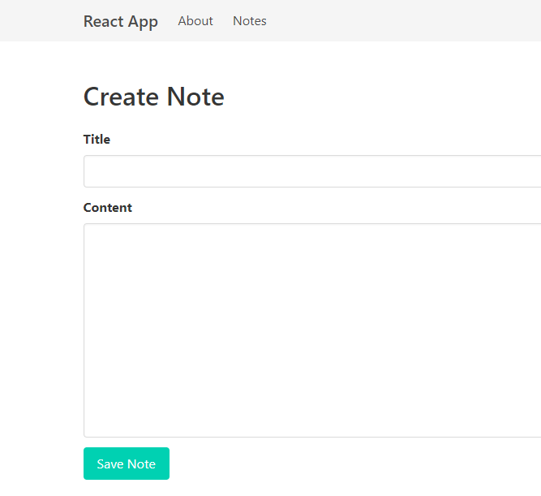
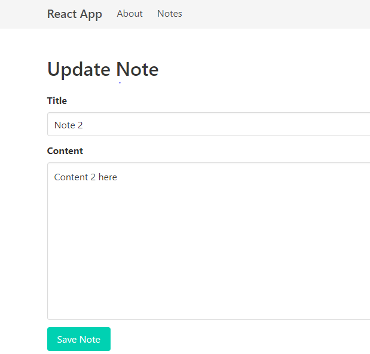
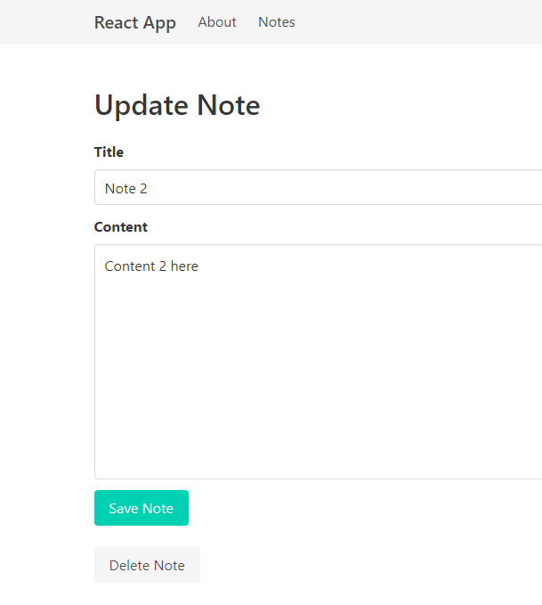

[Blog Home Page](../../README.md)

# Create a ReactJS and .NET Core Web App (Part 3: CRUD Front End)

_Tags: .NET, Back End, C#, Entity Framework, Front End, Full Stack, Javascript, React, REST_

Table of Contents
1. [Introduction](#introduction)
2. [Add Bulma CSS For Styling](#css)
3. [Add Base Line Components](#baseline)
4. [Add Routing](#routing)
5. [Add Notes Page](#notes)
6. [Add API Mock](#mock)
7. [Add Create Note Page](#create)
8. [Add Update Note Page](#update)
9. [Add Delete Note Functionality](#delete)
10. [Conclusion](#conclusion)
11. [Comments](#comments)

## 1. <a name='introduction'></a>Introduction

This is a continuation from the previous part, which can be found [here](../2020-09-07_CRUD%20Web%20App%20ReactJS%20and%20.NET%20Core/Post.md). This post focuses on adding CRUD functionality to the front end UI.

## 2. <a name='css'></a>Add Bulma CSS For Styling

Bulma is a popular CSS styling framework. The following steps are for installing and using Bulma in the web app.

1. Install bulma

   `npm install bulma`

2. Edit index.js to import bulma

   ```js
   import 'bulma/css/bulma.css';
   ```

3. Remove all existing styles from App.css

## 3. <a name='baseline'></a>Add Base Line Components

1. Create the following directory structure under the web app's src directory.

   ```
   api
   components
      about
      common
      home
      notes
   json-mock-api
   ```

2. Add the components/common/Navigation.js component. This will be used as the navigation bar for the web app. It is based on bulma's responsive navigation component.

   ```js
   import React from 'react';
   import { Link } from "react-router-dom";

   export default class Navigation extends React.Component {
      toggleBurgerMenu() {
         document.querySelector('.navbar-menu').classList.toggle('is-active');
      }
      
      render() {
         return (
            <nav className="navbar has-background-light" role="navigation" aria-label="main navigation">
            <div className="container">
               <div className="navbar-brand">
                  <Link to="/" className="navbar-item is-size-5 has-text-weight-semibold">React App</Link>

                  <a role="button" className="navbar-burger burger" aria-label="menu" aria-expanded="false" data-target="navbarBasic"
                  onClick={this.toggleBurgerMenu}>
                  <span aria-hidden="true"></span>
                  <span aria-hidden="true"></span>
                  </a>
               </div>

               <div id="navbarBasic" className="navbar-menu">
                  <div className="navbar-start">
                  <Link to="/about" className="navbar-item" onClick={this.toggleBurgerMenu}>About</Link>
                  <Link to="/notes" className="navbar-item" onClick={this.toggleBurgerMenu}>Notes</Link>
                  </div>
               </div>
            </div>
            </nav>
         );
      }
   }
   ```

3. Add the components/common/Layout.js component. This component will be the parent layout for each page for the web app.

   ```js
   import React, { Fragment } from 'react';
   import Navigation from './Navigation';

   export default class Layout extends React.Component {
      render() {
         return (
            <Fragment>
            <Navigation />
            <section className="section">
               <div className="App container">
                  {this.props.children}
               </div>
            </section>
            </Fragment>
         );
      }
   }
   ```

4. Add the components/common/MainTitle.js component. Each page will have a component to display the page's title.

   ```js
   import React from 'react';

   export default class MainTitle extends React.Component {
      render() {
         return (
            <h1 className="title">{this.props.children}</h1>
         );
      }
   }
   ```

5. Add the components/common/PrimaryButton.js component. This is the primary button component for the main call to action (CTA).

   ```js
   import React from 'react';

   export default class PrimaryButton extends React.Component {
      render() {
         return (
            <button className="button is-primary" {...this.props}>
                  {this.props.children}
            </button>
         );
      }
   }
   ```

6. Add the components/home/Home.js component.

   ```js
   import React, { Fragment } from 'react';
   import MainTitle from '../common/MainTitle';

   export default class Home extends React.Component {
      render() {
         return (
            <Fragment>
            <MainTitle>Home</MainTitle>
            </Fragment>
         );
      }
   }
   ```

## 4. <a name='routing'></a>Add Routing

1. Install react-router-dom
   
   `npm install react-router-dom`

2. Modify App.js as follows. Note the following
   * The parent rendered element is `<Router>`
   * Each `<Route>` will be a child of `<Switch>`
   * The default route "/" is connected to the Home page

   ```js
   import React from 'react';
   import {
      BrowserRouter as Router,
      Switch,
      Route
   } from 'react-router-dom';
   import './App.css';
   import Layout from './components/common/Layout';
   import Home from './components/home/Home';

   function App() {
      return (
         <Router>
            <Layout>
            <Switch>
               <Route path="/">
                  <Home />
               </Route>
            </Switch>
            </Layout>
         </Router>
      );
   }

   export default App;
   ```

## 5. <a name='notes'></a>Add Notes Page

1. Add the components/notes/NotesPage.js component.

   ```js
   import React, { Fragment } from 'react';
   import MainTitle from '../common/MainTitle';

   export default class NotesPage extends React.Component {
      render() {
         return (
            <Fragment>
            <MainTitle>NotesPage</MainTitle>
            </Fragment>
         );
      }
   }
   ```

2. Add a constructor to initialize the component's state. In this case, the state will contain a list of notes.

   ```js
   constructor() {
      super();
      this.state = { notes: [] };
   }
   ```

3. Create the api/NotesApi.js module to encapsulate getting notes from the Notes Web API. This module uses the Immediately Invoked Function Expression (IIFE) pattern.

   ```js
   var NotesApi = (function() {
      function _getBaseUrl() {
         return '/api/notes';
      }

      function get() {
         return fetch(_getBaseUrl())
            .then(rsp => rsp.json());
      }

      return {
         get: get
      };
   }());
  
   export default NotesApi;
   ```

4. Import the `NotesApi` in the `NotesPage` component.

   ```js
   import NotesApi from '../../api/NotesApi';
   ```

5. Add a `componentDidMount` method to the `NotesPage` to load notes from the Web API when the component is loaded.

   ```js
   componentDidMount() {
      NotesApi.get()
         .then(notes => {
            this.setState({ notes: notes });
         })
         .catch(err => {
            console.error(err);
         });
   }
   ```

6. Modify the `render` method to display loaded notes.

   ```js
   render() {
      return (
         <Fragment>
            <MainTitle>Notes</MainTitle>

            <Link to="/notes/create"><PrimaryButton>Add Note</PrimaryButton></Link>

            <table className="table">
               <thead>
                  <tr>
                     <th>Created</th>
                     <th>Title</th>
                     <th>Content</th>
                  </tr>
               </thead>
               <tbody>
                  {
                     this.state.notes.map(note => {
                        return <tr key={note.id}>
                           <td>{note.createdDate}</td>
                           <td>
                              <Link to={`/notes/${note.id}`}>
                                 {note.title}
                              </Link>
                           </td>
                           <td>{note.content}</td>
                        </tr>
                     })
                  }
               </tbody>
            </table>
         </Fragment>
      );
   }
   ```

7. Update App.js with the `NotesPage` route.

   ```js
   ...
   import React from 'react';
   import {
      BrowserRouter as Router,
      Switch,
      Route
   } from "react-router-dom";
   import './App.css';
   import Layout from './components/common/Layout';
   import Home from './components/home/Home';
   import NotesPage from './components/notes/NotesPage';

   function App() {
      return (
         <Router>
            <Layout>
            <Switch>
               <Route path="/notes">
                  <NotesPage />
               </Route>
               <Route path="/">
                  <Home />
               </Route>
            </Switch>
            </Layout>
         </Router>
      );
   }

   export default App;
   ```

8. At this point, the notes page will encounter an error if the notes Web API is not running. In the next section, we add a mock API to remove the reliance on the Web API while in development.

|  | 
|:--:| 
| *The Notes page* |

## 6. <a name='mock'></a>Add API Mock

1. Install json-server to mock the Web API back end.
   
   `npm install json-server --save-dev`

2. Add the file json-mock-api/db.json. Populate the file with mock notes objects.

   ```js
   {
      "notes": [
         {
            "id": 1,
            "createdDate": "2020-09-08T02:10:10.9799513Z",
            "title": "Note 1",
            "content": "Content 1 here"
         },
         {
            "id": 2,
            "createdDate": "2020-09-07T02:10:10.9802279Z",
            "title": "Note 2",
            "content": "Content 2 here"
         }
      ]
   }
   ```

3. Add the file json-mock-api/routes.json. Populate the file with the api prefix.

   ```js
   {
      "/api/*": "/$1"
   }
   ```

4. Add the "json-server" script to package.json.

   ```js
   ...
   "scripts": {
      "json-server": "node_modules\\.bin\\json-server --watch src\\json-mock-api\\db.json --routes src\\json-mock-api\\routes.json --port 5000",
      ...
   },
   ...
   ```

5. Install concurrently to enable running the "start" and "json-server" scripts in parallel.

   `npm install concurrently --save-dev`

6. Add the "dev" script to package.json. Executing `npm run dev` will run `npm start` and `npm run json-server`.

   ```js
   ...
   "scripts": {
      "dev": "concurrently \"npm start\" \"npm run json-server\"",
      ...
   },
   ...
   ```

7. Execute `npm run dev` and navigate to the notes page. Now, you should see the notes being loaded from the mock API.

|  | 
|:--:| 
| *The Notes page with mocked API* |

## 7. <a name='create'></a>Add Create Note Page

1. Add the `create` function to api/NotesApi.js.

   ```js
   var NotesApi = (function() {
      ...
      function create(note) {
         return fetch(_getBaseUrl(), {
            body: JSON.stringify(note),
            headers: {
               'content-type': 'application/json'
            },
            method: 'POST'
            });
      }

      return {
         ...
         create: create
      };
   }());
  
   export default NotesApi;
   ```

2. Add the components/notes/NoteForm.js component.

   ```js
   import React, { Fragment } from 'react';
   import PrimaryButton from '../common/PrimaryButton';

   export default class NoteForm extends React.Component {
      constructor(props) {
         super(props);
      
         this.state = {
               id: null,
               title: '',
               content: '',
               isStateInitialized: false,
               submitted: false
         };
      
         this.handleTitleChange = this.handleTitleChange.bind(this);
         this.handleContentChange = this.handleContentChange.bind(this);
         this.handleSubmit = this.handleSubmit.bind(this);
      }

      componentDidUpdate() {
         if(this.state.isStateInitialized || this.props.initialState == null)
               return;

         this.setState({ isStateInitialized: true });
         this.setState({ id: this.props.initialState.id });
         this.setState({ title: this.props.initialState.title });
         this.setState({ content: this.props.initialState.content });
      }

      handleTitleChange(e) {
         this.setState({ title: e.target.value });
      }

      handleContentChange(e) {
         this.setState({ content: e.target.value });
      }

      async handleSubmit(e) {
         this.props.onSubmit(e, this.state);
      }

      render() {
         return (
               <Fragment>
                  <form onSubmit={this.handleSubmit}>
                     <div className="field">
                        <label className="label">Title</label>
                        <div className="control">
                              <input
                                 id="titleInput"
                                 className="input"
                                 type="text"
                                 value={this.state.title}
                                 onChange={this.handleTitleChange} />
                        </div>
                     </div>
                     <div className="field">
                        <label className="label">Content</label>
                        <div className="control">
                              <textarea
                                 id="contentInput"
                                 className="textarea"
                                 cols="100"
                                 rows="10"
                                 value={this.state.content}
                                 onChange={this.handleContentChange} />
                        </div>
                     </div>
                     <div class="control">
                        <PrimaryButton type="submit">Save Note</PrimaryButton>
                     </div>
                  </form>
               </Fragment>
         );
      }
   }
   ```

3. Add the components/notes/CreateNotePage.js component.

   ```js
   import React, { Fragment } from 'react';
   import { withRouter } from 'react-router-dom';
   import MainTitle from '../common/MainTitle';
   import NoteForm from './NoteForm';
   import NotesApi from '../../api/NotesApi';

   class CreateNotePage extends React.Component {
      constructor(props) {
         super(props);
         this.handleSubmit = this.handleSubmit.bind(this);
      }

      async handleSubmit(e, state) {
         e.preventDefault();
      
         NotesApi.create(state)
         .then(rsp => {
            if (rsp.status === 201 || rsp.status === 204)
               this.props.history.push('/notes');
         })
         .catch(err => {
            console.error(err);
         });
      }

      render() {
         return (
            <Fragment>
            <MainTitle>Create Note</MainTitle>
            <NoteForm onSubmit={this.handleSubmit} />
            </Fragment>
         );
      }
   }

   export default withRouter(CreateNotePage);
   ```

4. Update App.js with the `CreateNotePage` route.

   ```js
   ...
   import React from 'react';
   import {
      BrowserRouter as Router,
      Switch,
      Route
   } from "react-router-dom";
   import './App.css';
   import Layout from './components/common/Layout';
   import Home from './components/home/Home';
   import NotesPage from './components/notes/NotesPage';
   import CreateNotePage from './components/notes/CreateNotePage';

   function App() {
      return (
         <Router>
            <Layout>
            <Switch>
               <Route path="/notes/create">
                  <CreateNotePage />
               </Route>
               <Route path="/notes">
                  <NotesPage />
               </Route>
               <Route path="/">
                  <Home />
               </Route>
            </Switch>
            </Layout>
         </Router>
      );
   }

   export default App;
   ```

|  | 
|:--:| 
| *The Create Note button* |

|  | 
|:--:| 
| *The Create Note page* |

The Create Note page

## 8. <a name='update'></a>Add Update Note Page

1. Add the `update` function to api/NotesApi.js.

   ```js
   var NotesApi = (function() {
      ...
      function update(note) {
         return fetch(`${_getBaseUrl()}/${note.id}`, {
            body: JSON.stringify(note),
            headers: {
               'content-type': 'application/json'
            },
            method: 'PUT'
          })
      }

      return {
         ...
         update: update
      };
   }());
  
   export default NotesApi;
   ```

2. Add the components/notes/UpdateNotePage.js component.

   ```js
   import React, { Fragment } from 'react';
   import { withRouter } from 'react-router-dom';
   import MainTitle from '../common/MainTitle';
   import NoteForm from './NoteForm';
   import NotesApi from '../../api/NotesApi';

   class UpdateNotePage extends React.Component {
      constructor(props) {
         super(props);
         
         this.state = {
            note: null
         };

         this.handleSubmit = this.handleSubmit.bind(this);
      }

      componentDidMount() {
         fetch(`/api/notes/${this.props.match.params.noteId}`)
            .then(rsp => rsp.json())
            .then(note => {
               this.setState({ note: note });
            })
            .catch(err => {
               console.error(err);
            });
      }

      async handleSubmit(e, state) {
         e.preventDefault();
      
         NotesApi.update(state)
         .then(rsp => {
            if (rsp.status === 200) {
               this.props.history.push('/notes');
            }
         })
         .catch(err => {
            console.error(err);
         });
      }

      render() {
         return (
            <Fragment>
               <MainTitle>Edit Note</MainTitle>
               <NoteForm
                  onSubmit={this.handleSubmit}
                  initialState={this.state.note} />
            </Fragment>
         );
      }
   }

   export default withRouter(UpdateNotePage);
   ```

4. Update App.js with the `UpdateNotePage` route.

   ```js
   ...
   import React from 'react';
   import {
      BrowserRouter as Router,
      Switch,
      Route
   } from "react-router-dom";
   import './App.css';
   import Layout from './components/common/Layout';
   import Home from './components/home/Home';
   import NotesPage from './components/notes/NotesPage';
   import CreateNotePage from './components/notes/CreateNotePage';
   import UpdateNotePage from './components/notes/UpdateNotePage';

   function App() {
      return (
         <Router>
            <Layout>
            <Switch>
               <Route path="/notes/create">
                  <CreateNotePage />
               </Route>
               <Route path="/notes/:noteId">
                  <UpdateNotePage />
               </Route>
               <Route path="/notes">
                  <NotesPage />
               </Route>
               <Route path="/">
                  <Home />
               </Route>
            </Switch>
            </Layout>
         </Router>
      );
   }

   export default App;
   ```

|  | 
|:--:| 
| *The Update Note page* |

## 9. <a name='delete'></a>Add Delete Note Functionality

1. Add the `deleteNote` function to api/NotesApi.js.

   ```js
   var NotesApi = (function() {
      ...
      function deleteNote(id) {
         return fetch(`${_getBaseUrl()}/${id}`, {
            method: 'DELETE'
         });
      }

      return {
         ...
         deleteNote: deleteNote
      };
   }());
  
   export default NotesApi;
   ```

2. Add the delete functionality to components/notes/UpdateNotePage.js.

   ```js
   ...
   constructor(props) {
      ...
      this.handleDelete = this.handleDelete.bind(this);
   }
   ...
   async handleDelete(e) {
      e.preventDefault();

      NotesApi.deleteNote(this.state.note.id)
         .then(rsp => {
            if (rsp.status === 200) {
            this.props.history.push('/notes');
            }
         })
         .catch(err => {
            console.error(err);
         });
   }
   ...
   render() {
      return (
         <Fragment>
            ...
            <button 
               className="button is-light mt-5"
               onClick={this.handleDelete}>
               Delete Note
            </button>
         </Fragment>
      );
   }
   ...
   ```

|  | 
|:--:| 
| *The Delete Note button* |

## 10. <a name='conclusion'></a>Conclusion

The full example source code can be found [here](src).

## 11. <a name='comments'></a>Comments

_Reply to [this tweet](https://twitter.com/innochi_mob/status/1312592004753297408)._