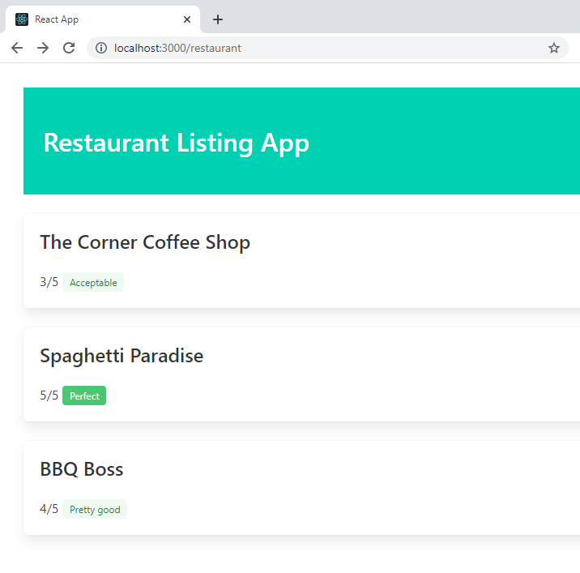
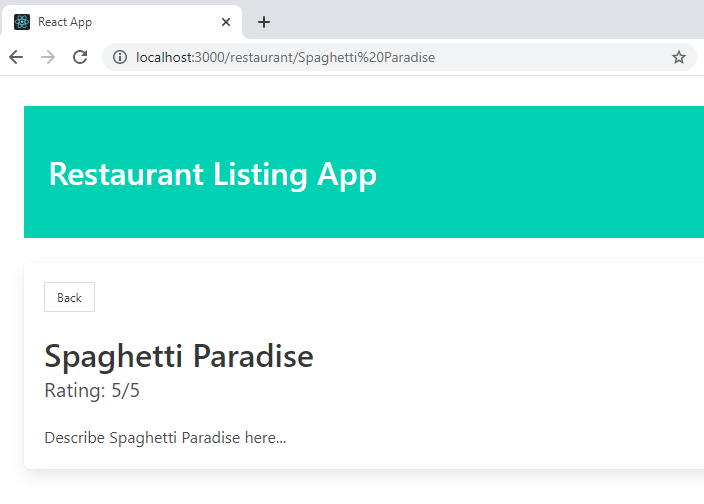

[Blog Home Page](../../README.md)

# React.js Basics

_Tags: Javascript, JS, React, Reference, UI_

Table of Contents
1. [Introduction](#intro)
2. [Initialize a React Project](#initialize)
3. [Components](#components)
4. [Style Components](#style)
4. [Router](#router)
5. [State](#state)
6. [Using APIs with React](#api)
8. [Conclusion](#conclusion)
9. [Comments](#comments)

## 1. <a name='intro'></a>Introduction

* Intent of this article
* What we will be building: restaurant listing
* What is react
* Intro to react concepts
* Essentials
* Reference guide

## 2. <a name='initialize'></a>Initialize a React Project

1. Open command line/terminal.
2. Install create-react-app package.
```
npm install -g create-react-app
```
3. Initialize a React app.
```
npm init react-app quick-start-app
```
4. Change to the `quick-start-app` directory.
```
cd quick-start-app
```
5. Start the app.
```
npm start
```

You should see this in a browser.

|  | 
|:--:| 
| *Default React app* |

## 3. <a name='components'></a>Components

1. Modify `src/App.js`.
```javascript
import './App.css';

// Import the RestaurantList component from this path
import RestaurantList from './restaurants/RestaurantList';

function App() {
  return (
    <div className="App">
      <h1>My Restaurant Listing App</h1>

      {/*Render the RestaurantList component and pass in a list of restaurants*/}
      <RestaurantList restaurants={[
        {
          name: 'The Corner Coffee Shop',
          rating: '3'
        },
        {
          name: 'Spaghetti Paradise',
          rating: '5'
        },
        {
          name: 'BBQ Boss',
          rating: '4'
        }
      ]}/>
    </div>
  );
}

export default App;
```
2. Create the `RestaurantList` component at `src/restaurant/RestaurantList.js`.
```javascript
// Import the RestaurantListItem component from this path
import RestaurantListItem from './RestaurantListItem';

// Destructure restaurants from props object
function RestaurantList({ restaurants }) {
  return (
    <ul>
        {/*For each restaurant, render the RestaurantListItem component*/}
        {restaurants.map(restaurant =>
          <li key={restaurant.name}>
            {/*Each child element must have a unique "key"*/}

            {/*Pass the restaurant object to the nested component*/}
            <RestaurantListItem
              restaurant = {restaurant} />
          </li>)}
    </ul>
  );
}

export default RestaurantList;
```
3. Create the `RestaurantListItem` component at `src/restaurant/RestaurantListItem.js`.
```javascript
// Destructure restaurant from props object
function RestaurantListItem({ restaurant }) {
  return (
    <div>
      {restaurant.name}. Rating: {restaurant.rating}
    </div>
  );
}

export default RestaurantListItem;
```

At this point, the app should look like this.

|  | 
|:--:| 
| *React app with components* |

## 4. <a name='style'></a>Style Components

1. Install a CSS framework of your choice. In this case, bulma.
```
npm install --save bulma
```

2. Add this to the top of `src/index.js`.
```javascript
// Import css framework
import "bulma/css/bulma.min.css";
```

3. Modify `src/App.js`.
```javascript
// Import css styles
import './App.css';

// Import the RestaurantList component from this path
import RestaurantList from './restaurants/RestaurantList';

function App() {
  return (
    <div className="App">
      <div className="App">
      <section className="hero is-primary">
        <div className="hero-body">
          <p className="title">
            Restaurant Listing App
          </p>
        </div>
      </section>

      {/*Render the RestaurantList component and pass in a list of restaurants*/}
      <RestaurantList restaurants={[
        {
          name: 'The Corner Coffee Shop',
          rating: '3'
        },
        {
          name: 'Spaghetti Paradise',
          rating: '5'
        },
        {
          name: 'BBQ Boss',
          rating: '4'
        }
      ]}/>
    </div>
  );
}

export default App;
```

4. Modify `src/App.css`.
```css
.App {
  margin: 30px;
}
```

5. Modify `src/restaurants/RestaurantList.js`.
```javascript
// Import the RestaurantListItem component from this path
import RestaurantListItem from './RestaurantListItem';

import './RestaurantList.css';

// Destructure restaurants from props object
function RestaurantList({ restaurants }) {
  return (
    <ul>
        {/*For each restaurant, render the RestaurantListItem component*/}
        {restaurants.map(restaurant =>
          <li key={restaurant.name}>
            {/*Each child element must have a unique "key"*/}

            {/*Pass the restaurant object to the nested component*/}
            <RestaurantListItem
              restaurant = {restaurant} />
          </li>)}
    </ul>
  );
}

export default RestaurantList;
```

6. Create `src/restaurants/RestaurantList.css`.
```css
ul {
  list-style-type: none;
  padding: 0;
  margin: 0;
}
```

7. Modify `src/restaurants/RestaurantListItem.js`.
```javascript
// Destructure restaurant from props object
function RestaurantListItem({ restaurant }) {
  function getRatingElement(rating) {
    // Example of conditional rendering
    switch(rating) {
      case '5':
        return <span className="tag is-success">Perfect</span>;
      case '4':
        return <span className="tag is-success is-light">Pretty good</span>;
      case '3':
        return <span className="tag is-success is-light">Acceptable</span>;
      default:
        return <span className="tag is-danger">Hmmm...</span>;
    }
  }

  return (
    <div className="box mt-5">
      <p className="title is-4">{restaurant.name}</p>
      <p>
        {restaurant.rating}/5&nbsp;
        {getRatingElement(restaurant.rating)}
      </p>
    </div>
  );
}

export default RestaurantListItem;
```

At this point, the app should look like this.

|  | 
|:--:| 
| *React app with styled components* |

## 5. <a name='router'></a>Router

1. Install react-router-dom.
```
npm install --save react-router-dom
```

2. Modify `src/App.js`.
```javascript
// Import css styles
import './App.css';

// Import router components
import { BrowserRouter as Router, Route, Switch } from 'react-router-dom';

// Import the page components
import RestaurantListPage from './restaurants/RestaurantListPage';
import RestaurantItemPage from './restaurants/RestaurantItemPage';
import PageNotFound from './common/PageNotFound';

function App() {
  return (
    <div className="App">
      <section className="hero is-primary">
        <div className="hero-body">
          <p className="title">
            Restaurant Listing App
          </p>
        </div>
      </section>

      {/*Map routes to components. Order matters!*/}
      <Router>
        <Switch>
          <Route exact path="/" component={RestaurantListPage} />
          <Route path="/restaurant/:id" component={RestaurantItemPage} />
          <Route path="/restaurant" component={RestaurantListPage} />
          <Route component={PageNotFound} />
        </Switch>
      </Router>
    </div>
  );
}

export default App;
```

3. Add `src/restaurants/RestaurantListPage.js`.
```javascript
// Import the RestaurantList component from this path
import RestaurantList from './RestaurantList';

function RestaurantListPage() {
  return (
    <>
      {/*Render the RestaurantList component and pass in a list of restaurants*/}
      <RestaurantList restaurants={[
        {
          name: 'The Corner Coffee Shop',
          rating: '3',
          description: 'Describe The Corner Coffee Shop here...'
        },
        {
          name: 'Spaghetti Paradise',
          rating: '5',
          description: 'Describe Spaghetti Paradise here...'
        },
        {
          name: 'BBQ Boss',
          rating: '4',
          description: 'Describe BBQ Boss here...'
        }
      ]}/>
    </>
  );
}

export default RestaurantListPage;
```

4. Add `src/restaurants/RestaurantItemPage.js`.
```javascript
// Import Back component
import Back from '../common/Back';

function RestaurantItemPage({location, history}) {
  return (
    <div className="box mt-5">
      {/*Back button*/}
      <Back history={history} />

      <p className="title is-3">{location.state.restaurant.name}</p>
      <p className="subtitle is-5">Rating: {location.state.restaurant.rating}/5</p>
      <p>{location.state.restaurant.description}</p>
    </div>
  );
}

export default RestaurantItemPage;
```

5. Add `src/common/PageNotFound.js`.
```javascript
function PageNotFound() {
  return (
    <div className="box mt-5">
      <p className="title is-4 has-text-danger">Error. Page not found.</p>
    </div>
  );
}

export default PageNotFound;
```

6. Add `src/common/Back.js`.
```javascript
// Destructure history from props object
function Back({ history }) {
  function onBackClick() {
    history.goBack();
  }
  
  return (
  <div className="columns">
    <div className="column">
      <button
        className="button is-small"
        onClick={() => onBackClick()}>
        Back
      </button>
    </div>
  </div>
  );
}

export default Back;
```

7. Modify `src\restaurants\RestaurantListItem.js`
```javascript
// Import Link component
import { Link } from 'react-router-dom';

// Destructure restaurant from props object
function RestaurantListItem({ restaurant }) {
  function getRatingElement(rating) {
    // Example of conditional rendering
    switch(rating) {
      case '5':
        return <span className="tag is-success">Perfect</span>;
      case '4':
        return <span className="tag is-success is-light">Pretty good</span>;
      case '3':
        return <span className="tag is-success is-light">Acceptable</span>;
      default:
        return <span className="tag is-danger">Hmmm...</span>;
    }
  }

  return (
    <Link to={{
      pathname: '/restaurant/' + restaurant.name,
      // Pass restaurant object to linked page
      state: {
        restaurant: restaurant
      }
    }}>
      <div className="box mt-5">
        <p className="title is-4">{restaurant.name}</p>
        <p>
          {restaurant.rating}/5&nbsp;
          {getRatingElement(restaurant.rating)}
        </p>
      </div>
    </Link>
  );
}

export default RestaurantListItem;
```

When you click on a restaurant box, you should be taken to a page that displays the individual restaurant information. Clicking on the Back button will take you to the previous page.

|  | 
|:--:| 
| *Individual restaurant page* |

## 6. <a name='state'></a>State

## 7. <a name='api'></a>Using APIs with React

## 8. <a name='conclusion'></a>Conclusion

Next steps:
* Testing components, state, hooks, router
* Sharing state between components
* Code maintanability/best practices
* Deploy a react app
* Redux
* Thunk
* Selectors

## 9. <a name='comments'></a>Comments

_Reply to [this tweet]()._