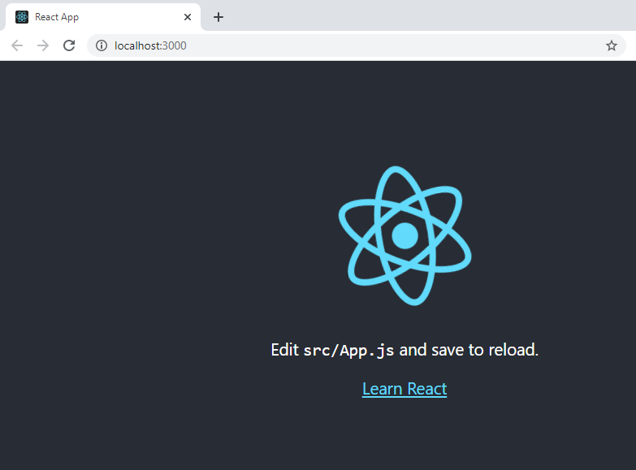

[Blog Home Page](../../README.md)

# React Quick Start and Essentials

_Tags: Javascript, JS, React, Reference, UI_

Table of Contents
1. [Introduction](#intro)
2. [Initialize a React Project](#initialize)
3. [Components](#components)
4. [Style Components](#style)
4. [Router](#router)
5. [State](#state)
6. [Using APIs with React](#api)
8. [Conclusion](#conclusion)
9. [Comments](#comments)

## 1. <a name='intro'></a>Introduction

* Intent of this article
* What we will be building: restaurant listing
* What is react
* Intro to react concepts
* Essentials
* Reference guide

## 2. <a name='initialize'></a>Initialize a React Project

1. Open command line/terminal
2. Install create-react-app package
```
npm install -g create-react-app
```
3. Initialize a React app
```
npm init react-app quick-start-app
```
4. Change to the `quick-start-app` directory.
```
cd quick-start-app
```
5. Start the app
```
npm start
```

You should see this in a browser

|  | 
|:--:| 
| *Default react app* |

## 3. <a name='components'></a>Components

1. Modify `src/App.js` to look like this.
```javascript
import './App.css';

// Import the RestaurantList component from this path
import RestaurantList from './restaurants/RestaurantList';

function App() {
  return (
    <div className="App">
      <h1>My Restaurant Listing App</h1>

      {/*Render the RestaurantList component and pass in a list of restaurants*/}
      <RestaurantList restaurants={[
        {
          name: 'The Corner Coffee Shop',
          rating: '3'
        },
        {
          name: 'Spaghetti Paradise',
          rating: '5'
        },
        {
          name: 'BBQ Boss',
          rating: '4'
        }
      ]}/>
    </div>
  );
}

export default App;
```
2. Create the `RestaurantList` component at `src/restaurant/RestaurantList.js`
```javascript
// Import the RestaurantListItem component from this path
import RestaurantListItem from './RestaurantListItem';

// Destructure restaurants from props object
function RestaurantList({ restaurants }) {
  return (
    <ul>
        {/*For each restaurant, render the RestaurantListItem component*/}
        {restaurants.map(restaurant =>
          <li key={restaurant.name}>
            {/*Each child element must have a unique "key"*/}

            {/*Pass the restaurant object to the nested component*/}
            <RestaurantListItem
              restaurant = {restaurant} />
          </li>)}
    </ul>
  );
}

export default RestaurantList;
```
3. Create the `RestaurantListItem` component at `src/restaurant/RestaurantListItem.js`
```javascript
// Destructure restaurant from props object
function RestaurantListItem({ restaurant }) {
  return (
    <div>
      {restaurant.name}. Rating: {restaurant.rating}
    </div>
  );
}

export default RestaurantListItem;
```

## 4. <a name='style'></a>Style Components

## 8. <a name='conclusion'></a>Conclusion

Next steps:
* Testing components, state, hooks, router
* Sharing state between components
* Code maintanability/best practices
* Deploy a react app

## 9. <a name='comments'></a>Comments

_Reply to [this tweet]()._