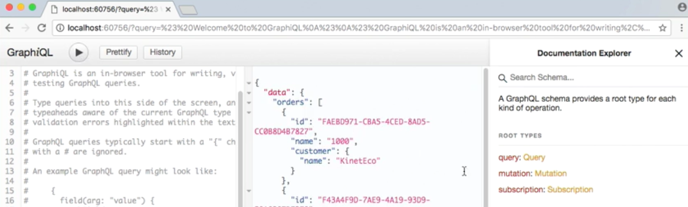
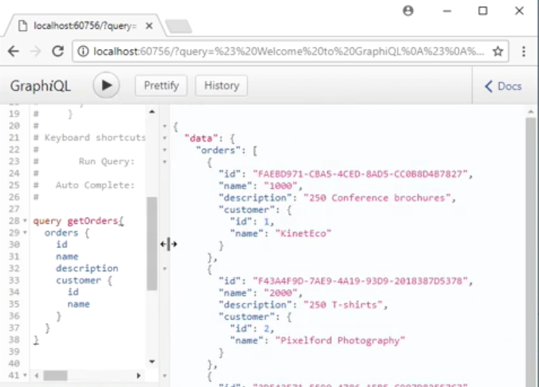
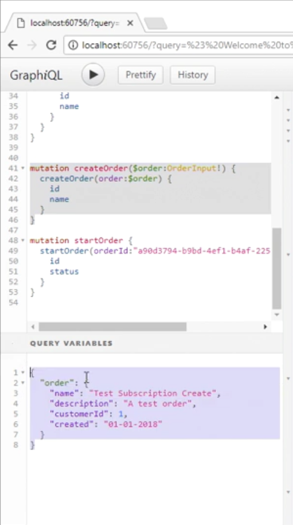
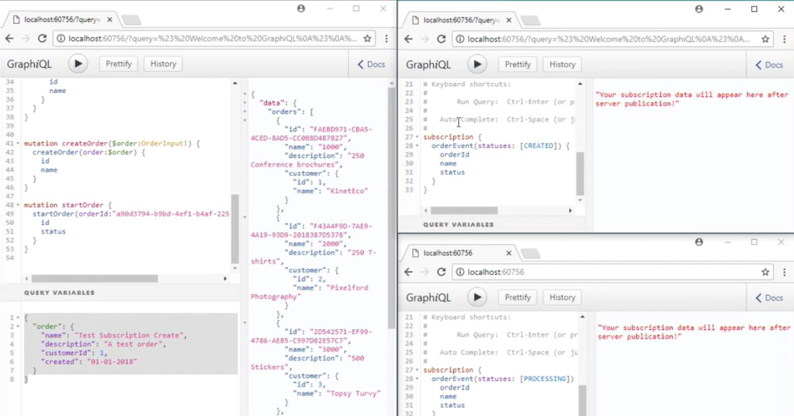

[Blog Home Page](../../README.md)

# Course Notes: API Development in .NET with GraphQL

_Tags: .NET, API, Course, GraphQL, Notes_

Table of Contents
1. [Introduction](#intro)
2. [What is GraphQL.NET?](#what)
3. [Course Goals](#goals)
4. [Allowing Updates Through Mutations](#mutations)
5. [Enabling CLients to Subscribe to Notifications](#subscribe)
7. [Conclusion](#conclusion)
8. [Comments](#comments)

## 1. Introduction

["API Development in .NET with GraphQL"](https://www.linkedin.com/learning/api-development-in-dot-net-with-graphql/welcome) is a LinkedIn Learning course by Glenn Block. This course is an introduction to API Development in .NET with GraphQL.

## 2. What is GraphQL.NET?

* Open source library for building a GraphQL server
* Stand up GraphQL endpoint for queries, mutations and subscriptions
* Supports .NET Framework and Core

## 3. Course Goals

* Use the GraphiQL (pronounced "graphical") interface to perform GraphQL requests and serve API documentation
* Create a GraphQL server that supports:
  * Queries to get data
  * Mutations to add or modify data
  * Subscriptions to subscribe to data events via a "push" mechanism

## 4. GraphiQL

GraphiQL is a browser-based editor to execute queries and mutations against a GraphQL API server. GraphiQL also hosts API documentation.

|  | 
|:--:| 
| *API Documentation in GraphiQL* |

## 5. Queries

Below is an example query in GraphiQL. The query specifies what type of data and which properties to return. Note the nested `customer` property which is linked to the `Customer` object.

|  | 
|:--:| 
| *Queries in GraphiQL* |

## 6. Mutations

Below is an example mutation in GraphiQL to create a record (an order) and update a record (start an order). `$order` is a variable with its value specified in the Query Variables window.

|  | 
|:--:| 
| *Mutations in GraphiQL* |

## 7. Subscriptions

Below is an example subscription in GraphiQL. Clients that subscribe to a pre-defined will get a push notification when the event occurs. In this case, one client (upper right window) subscribes to the order created event. Another client (lower right window) subscribes to the order started event. When a subscribed event occurs, the event details will show up in the window that says "Your subscription data will appear here after server publication!".

|  | 
|:--:| 
| *Subscriptions in GraphiQL* |

## 8. Conclusion

This course is a practical introduction to GraphQL with real examples. Here are some related topics to dig in deeper:
* Authentication and authorization
* Subscription performance (eg. how do connections scale, etc)
* HTTP request equivalent of GraphQL queries
* Usage with SPA frameworks (eg. Reactjs)

## 9. Comments

_Reply to [this tweet]()._