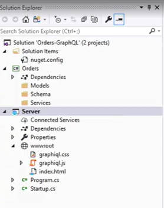

[Blog Home Page](../../README.md)

# Course Notes: API Development in .NET with GraphQL

_Tags: .NET, API, Course, GraphQL, Notes_

Table of Contents
1. [Introduction](#introduction)
2. [Creating a New GraphQL Project](#new-project)
3. [Exposing a New GraphQL API](#new-api)
4. [Allowing Updates THrough Mutations](#mutations)
5. [Enabling CLients to Subscribe to Notifications](#subscribe)
7. [Conclusion](#conclusion)
8. [Comments](#comments)

## 1. Introduction

["API Development in .NET with GraphQL"](https://www.linkedin.com/learning/api-development-in-dot-net-with-graphql/welcome) is a LinkedIn Learning course by Glenn Block. This course is an introduction to API Development in .NET with GraphQL.

### What is GraphQL.NET?

* Open source library for building a GraphQL server
* Stand up GraphQL endpoint for queries, mutations and subscriptions
* Supports .NET Framework and Core

## Course Goals

* Create a GraphSQL server that supports
  * Queries to get data
  * Mutations to add new or modify existing data
  * Subscriptions to subscribe to data events via a "push" mechanism
* Use the GraphiQL (pronounced "graphical") interface to perform GraphQL requests

## 2. Creating a New GraphQL Project

1. Create an ASP web app/server project
2. Add static GraphiQL files
3. Create class library for Orders (to keep projects separate)
4. Install nuget packages on Orders project
  * GraphQL
  * System.Reactive
5. Install nuget packages on Server project
  * Microsoft.AspNetCore.StaticFiles
  * GraphQL.Server.Transports.WebSockets
  * System.Reactive
6. Update Startup.cs to host static files

|  | 
|:--:| 
| *New solution structure* |

## 3. Exposing a New GraphQL API

## 4. Allowing Updates THrough Mutations

## 5. Enabling CLients to Subscribe to Notifications

## 6. Conclusion

Share your leadership philosophy:
1. Let people know what you're doing and why
2. Share your maxims
3. Provide your maxims in writing

Obstacles
* Lack of emotional connection
* Lack of application
* Letting maxims get stale

Re-evaluate your maxims regularly
Put your maxims where you can see them
Make your maxims part of your daily routine

Next Steps
* Dccument your maxims
* Share them with others
* Make sure the maxims are internally consistent

## 7. Comments

_Reply to [this tweet]()._